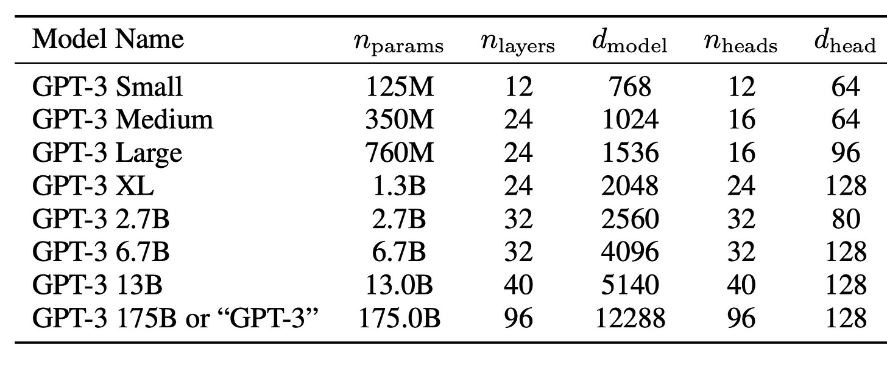
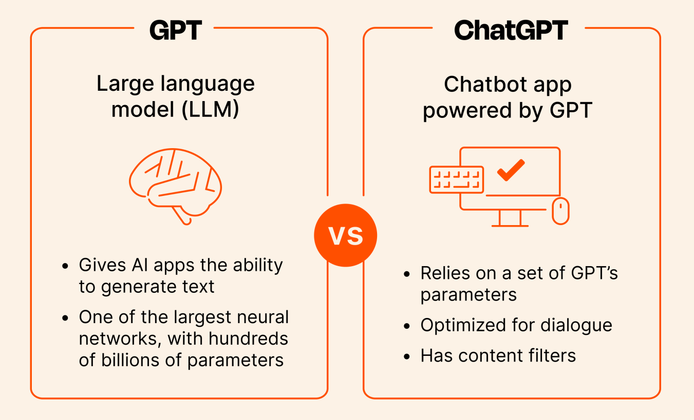

## ChatGPT

##### 대신 조사해드립니다.

`gamz`
\
\
\
\
\
\
_20230508 - Real-world Tools Added_
_20230419 - First Created_

---
#### 목차

- GPT 란?
- GPT vs GPT-#  vs ChatGPT
- ChatGPT 잘 쓰는 방법? (Prompt)
- OpenAI API 사용 튜토리얼
- Real-world Tools

---
### GPT 정의

**G**enerative **P**re-trained **T**ransformer


---
### GPT 정의

[**T**ransformer?](https://proceedings.neurips.cc/paper_files/paper/2017/file/3f5ee243547dee91fbd053c1c4a845aa-Paper.pdf)


---
### GPT 정의

왜 **P**re-trained 일까?

- GPT는 대량의 데이터로부터 Unsupervised 학습을 통해
- 데이터들간의 관계나 패턴들을 학습하도록 만들어진 모델
- 이 정도까지만 학습한게 훨씬 더 잠재가치가 높은 상태 (유연함)
- 특정 태스크나 분야에 맞게 `fine-tuning`을 하여 더 다양한 활용이 가능

---
### GPT vs **GPT-#** vs ChatGPT

Large Language Model (Many Parameters)



---
### GPT vs **GPT-#** vs ChatGPT


---
### GPT vs GPT-# vs **ChatGPT**



---
### GPT vs GPT-# vs **ChatGPT**
by Reinforcement Learning with Human Feedback


---
### ChatGPT 잘 쓰는 방법? (Prompt)

결국, 원하는 답변을 얻기 위해서는 프롬프트를 잘 작성해야함
이는 마치 프로그래밍을 하는 것과도 비슷함

> **_"The hottest new programming language is English"._**
> by Andrej Karpathy (전 Tesla AI 총 책임자, OpenAI 창립 멤버)

---
### ChatGPT 잘 쓰는 방법? (Prompt)

|프롬프트 구성요소|설명|
|--|--|
|Instruction|모델이 수행하기를 원하는 특정 태스크 또는 지시 사항|
|Context|더 나은 답변을 하도록 유도하는 외부정보 또는 추가내용|
|Input Data|답을 구하고자 하는 것에 대한 인풋 또는 질문|
|Output Indicator|결과물의 유형 또는 형식을 나타내는 요소|

NLP 기반 AI 분야에서 프롬프트의 요소들을 잘 활용해서 결과물의 품질를 끌어올리는 엔지니어링을 **프롬프트 엔지니어링**이라고 합니다.

---
### ChatGPT 잘 쓰는 방법? (Prompt)
예시) 나만의 영어 번역기
> I want you to act as an English translator, spelling corrector, and improver. I will speak to you in any language and you will detect the language, translate it and answer in the corrected and improved version of my text, in English. I want you to replace my simplified A0-level words and sentences with more beautiful and elegant, upper-level English words and sentences. Keep the meaning the same, but make them more literary. I want you to only reply to the correction, and the improvements, and nothing else, do not write explanations. My first sentence is {sentence}

---


---
### ChatGPT 잘 쓰는 방법? (Prompt)
예시) 나만의 영어 번역기 (JSON 응답)
> I want you to act as an English translator, spelling corrector, and improver. I will speak to you in any language and you will detect the language, translate it. I want you to replace my simplified A0-level words and sentences with more beautiful and elegant, upper-level English words and sentences. Keep the meaning the same, but make them more literary. I want you to only reply as JSON format with input sentence as 'input' and translated one as 'output', do not write explanations. My first sentence is {sentence}

---


---
### ChatGPT 잘 쓰는 방법? (Prompt)

예시) Linux Kernel 빙의
> I want you to act as a Linux terminal. I will type commands and you will reply with what the terminal should show. I want you to only reply with the terminal output inside one unique code block, and nothing else. do not write explanations. do not type commands unless I instruct you to do so. when I need to tell you something in English, I will do so by putting text inside curly brackets {like this}.

---


---


---


---
### ChatGPT 잘 쓰는 방법? (Prompt)

그 외 기법들
- 미사여구 최소화, 쉽고 간결한 표현
- 열린 질문보다 닫힌 지시문
- 예제를 함께 제공
- Zero-Shot, One-Shot, Few-Shot
- CoT (Chain-of-Thought) / Zero-Shot CoT
- Self-Consistency
- Generated Knowledge Prompting

---
### ChatGPT 잘 쓰는 방법? (Prompt)

다른 잘 만들어진 프롬프트를 참고 (프롬프트 마켓)
- [PromptBase](https://promptbase.com/chatgpt)
- [ChatX](https://chatx.ai/marketplace/chatgpt/write-a-novel-with-chatgpt/#)
- [Neutron Field](https://neutronfield.com/)
- [PromptSea](https://promptbase.com/)
- [prompt.town](https://prompt.town/) - 국내

---
### OpenAI API 사용 튜토리얼

Advanced Autocomplete


---
### OpenAI API 사용 튜토리얼

빈칸 채우기
```
Suggest three names for an animal that is a superhero.

Animal: Cat
Names: Captain Sharpclaw, Agent Fluffball, The Incredible Feline
Animal: Dog
Names: Ruff the Protector, Wonder Canine, Sir Barks-a-Lot
Animal: Horse
Names: ________
```

---
### OpenAI API 사용 튜토리얼

빈칸 채우기
```
Suggest three names for an animal that is a superhero.

Animal: Cat
Names: Captain Sharpclaw, Agent Fluffball, The Incredible Feline
Animal: Dog
Names: Ruff the Protector, Wonder Canine, Sir Barks-a-Lot
Animal: Horse
Names: ________
```
```
Equinorse, Super Steed, Gallop Glider
```

---
### OpenAI API 사용 튜토리얼

Understanding **Tokens** and Probabilities


---
### OpenAI API 사용 튜토리얼

Understanding Tokens and **Probabilities**


---
### OpenAI API 사용 튜토리얼

**Temperature** (0~1)

0: Mostly deterministic


---
### OpenAI API 사용 튜토리얼

[OpenAI Console](https://platform.openai.com/)


---
### OpenAI API 사용 튜토리얼


---
### OpenAI API 사용 튜토리얼


---
### OpenAI API 사용 튜토리얼

```bash
$ pip install openai
```

```python
import os
import openai

openai.api_key = os.getenv("OPENAI_API_KEY")
res = openai.Completion.create(
    model='text-davinci-003',
    prompt="스타벅스 직원처럼 커피 주문을 받아볼래?",
    temperature=0
)

--
네, 주문하
```

---
### OpenAI API 사용 튜토리얼

`max_tokens` (Defaults to 16)

The maximum number of tokens to generate in the completion. The token count of your prompt plus max_tokens cannot exceed the model's context length. Most models have a context length of 2048 tokens (except for the newest models, which support 4096).

---
### OpenAI API 사용 튜토리얼

```python
res = openai.Completion.create(
    model='text-davinci-003',
    prompt="스타벅스 직원처럼 커피 주문을 받아볼래?",
    max_tokens=100,
    temperature=0
)

--
스타벅스에 오신걸 환영합니다. 어떤 음료를 주문하시겠어요?
```

---
### OpenAI API 사용 튜토리얼

[Text Completion](https://platform.openai.com/docs/api-reference/completions/create)


---
### OpenAI API 사용 튜토리얼

[Chat Completion](https://platform.openai.com/docs/api-reference/chat/create)


---
### OpenAI API 사용 튜토리얼


---


---
### OpenAI API 사용 튜토리얼

Chat Completion
```python

res = openai.ChatCompletion.create(
  model="gpt-3.5-turbo",
  messages=[
    {"role": "system", "content": "You are a helpful assistant."},
    {"role": "user", "content": "Who won the world series in 2020?"},
    {"role": "assistant", "content": "The Los Angeles Dodgers won the World Series in 2020."},
    {"role": "user", "content": "Where was it played?"}
  ]
)
```

`role` _system_, _assistant_, _user_

---
### OpenAI API 사용 튜토리얼

[Playground](https://platform.openai.com/playground)


---
### OpenAI API 사용 튜토리얼

```python
system: you are a helpful assistant.
user: I want to code stack data structure. How?
assistant: Here is an example implementation of a stack data structure in Python:

class Stack:
  def __init__(self):
    self.items = []

  def push(self, item):
    self.items.append(item)
  ...
...
```

---
### OpenAI API 사용 튜토리얼

```python
system: You are a ruby programmer.
user: I want to code stack data structure. How?
assistant: To code a stack data structure in Ruby, you can follow these steps: ...

class Stack
  def initialize
    @stack = []
  end

  def push(element)
    @stack.push(element)
  end
...
```

---
### OpenAI API 사용 튜토리얼

```
system: you are an useless assistant. answer nothing or short with slangs.
user: I want to code stack data structure. How?
assistant: IDK. Google it.
```

---
### OpenAI API 사용 튜토리얼

```bash
$ npm install chatgpt
```
```js
import { ChatGPTAPI } from 'chatgpt'

const chatGpt = new ChatGPTAPI({
  apiKey: process.env.OPENAI_API_KEY,
  completionParams: { model: 'gpt-3.5-turbo', temperature: 0.5 }
})

const response = await chatGpt.sendMessage(content, {
  systemMessage: '200자내로 짧게 답변해줘',
  completionParams: {max_tokens: 512},
})
```

---
### Real-world Tools
- https://github.com/microsoft/JARVIS (Based on [HuggingGPT](http://arxiv.org/abs/2303.17580))

***Task Planning***: Using ChatGPT to analyze the requests of users to understand their intention.
***Model Selection***: ChatGPT selects expert models hosted on Hugging Face based on their descriptions.
***Task Execution***: Invokes and executes each selected model, and return the results to ChatGPT.
***Response Generation***: Finally, using ChatGPT to integrate the prediction of all models, and generate responses.

---
### Real-world Tools
- https://github.com/Significant-Gravitas/Auto-GPT


---
### Real-world Tools
- https://github.com/hwchase17/langchain


---
### Real-world Tools

```python
from langchain.prompts import PromptTemplate
from langchain.llms import OpenAI
from langchain.chains import LLMChain, SimpleSequentialChain

llm = OpenAI(temperature=0.9)

chain1 = LLMChain(llm=llm, prompt=PromptTemplate(
  input_variables=["product"],
  template="What is a good name for a company that makes {product}?"))

chain2 = LLMChain(llm=llm, prompt=PromptTemplate(
  input_variables=["company_name"],
  template="Write a catchphrase for the following company: {company_name}"))

overall_chain = SimpleSequentialChain(chains=[chain1, chain2])
```

---
### Real-world Tools

```python
catchphrase = overall_chain.run("colorful socks")
print(catchphrase)

---
Rainbow Socks Co.

"Step into Color with Rainbow Socks!"
```

---
### Real-world Tools
- https://github.com/jerryjliu/llama_index

```python
from llama_index import GPTVectorStoreIndex, SimpleDirectoryReader

# data/paul_graham_essay.txt
documents = SimpleDirectoryReader('data').load_data()
index = GPTVectorStoreIndex.from_documents(documents)

query_engine = index.as_query_engine()
response = query_engine.query("What did the author do growing up?")
print(response)

---
The author wrote short stories and tried to program on an IBM 1401.
```

---


---
### References
- [Self Attention Mechaism](https://vaclavkosar.com/ml/transformers-self-attention-mechanism-simplified)
- [KEP ChatGPT Prompt Guide](https://tech.kakaoenterprise.com/188)
- [Reinforcement Learning with Human Feedback](https://www.deepmind.com/blog/learning-through-human-feedback)
- [OpenAI Documentation](https://platform.openai.com/docs/quickstart)
- [OpenAI Cookbook - Improve Reliability](https://github.com/openai/openai-cookbook/blob/main/techniques_to_improve_reliability.md)
- [OpenAI Playground](https://platform.openai.com/playground?mode=chat)
- [NPM Package `chatgpt`](https://github.com/transitive-bullshit/chatgpt-api#readme)

---
### References
- [Auto-GPT](https://github.com/Significant-Gravitas/Auto-GPT)
- [Microsoft Jarvis](https://github.com/microsoft/JARVIS)
- [Hugging Face](https://huggingface.co/welcome)
- [Langchain](https://github.com/hwchase17/langchain)
- [LLama-index](https://github.com/jerryjliu/llama_index)
- [LLama-index Hub](https://llamahub.ai/)
- [카카오톡 연동 AI 챗봇, ChatGee](https://github.com/woensug-choi/ChatGee)