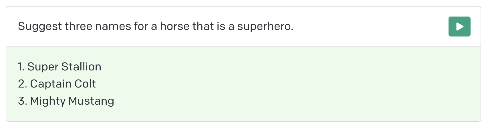
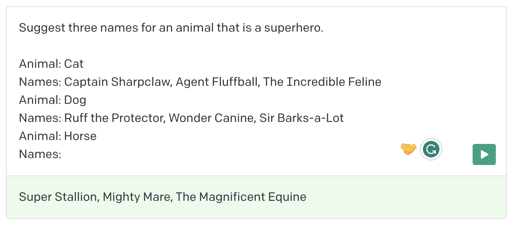
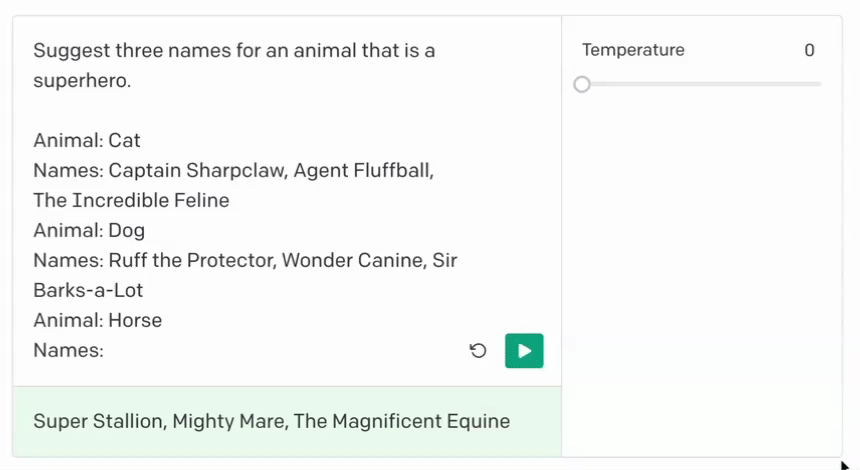
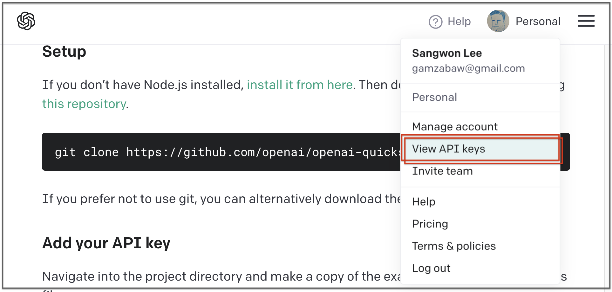
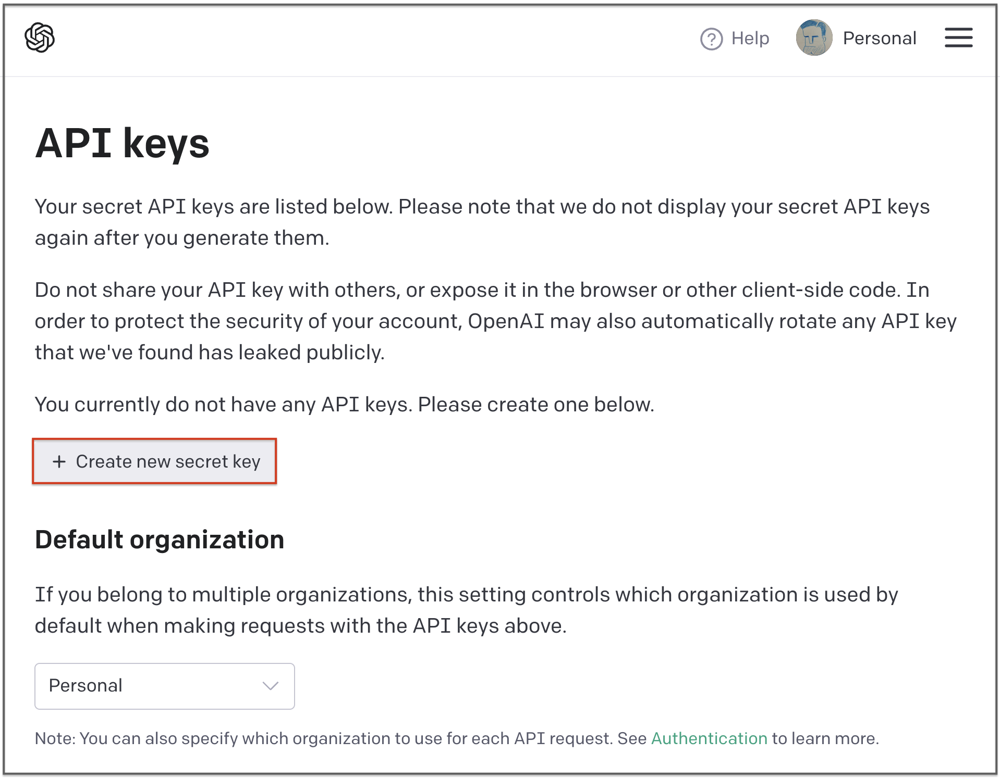
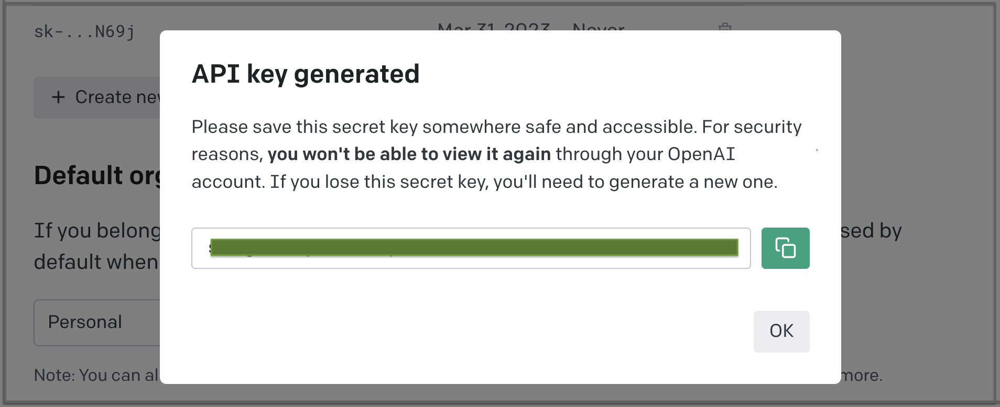

## ChatGPT 맛보기

### Quickstart

OpenAI에서 제공하는 [Quickstart](https://platform.openai.com/docs/quickstart) 문서부터 읽기 시작

OpenAI는 understanding & generating text 가 매우 좋은 cutting-edge 언어 모델을 만들어가고 있다고 함


#### 이들이 제공하는 API를 이용하면 다음의 것들도 할 수 있음
- Content generation
- Summarization
- Classification, categorization, and sentiment analysis
- Data extraction
- Translation
- Many more!


#### 코어 API는 `completions` endpoint (prompt로 입력을 주면 text를 완성해줌)
`very advanced autocomplete` 라고 생각할 수도 있다고 함


#### _"Designing your prompt is essentially how you “program” the model."_
앞으로 우리(엔지니어)가 해야할 일이 무엇인지 명확히 설명해주고 있음


#### 말 이름을 지어달라는 간단한 예시로 시작
- 간단하게 질문하자면,
  

- 질문(instruction)에 조금 더 제약이나 힌트를 줄 수 있음. 가령, 개수를 제한한다거나
  

- 몇 가지 예시를 제공하여 패턴을 찾을 수 있도록 한다거나
  

- 또한, 응답 결과를 좀 더 동적으로 조절하기 위한 `temperature` 개념이 있음 (0:고정 ~ 1:동적)
  

### 핸즈온, 일단 시작

#### 우선, API Key가 필요
- 가입 후에 계정 메뉴 보면 `View API Keys` 가 있음
  

- 여기서 `Create new secret key`를 하면 새로운 키를 발급받을 수 있음
  

- 발급 받은 키를 복사
  

#### 이제 테스트해보기 위한 기본 셋업을 해보자

필요한 주요 패키지는 `openai`로 일단 설치를 하고

```
$ pip install openai
```

부여받은 키를 `openai`에 주입해주자


```python
import os
import openai
import json
from dotenv import load_dotenv

load_dotenv()

# .env 파일에 OPENAI_API_KEY = <generated-secret-key>
openai.api_key = os.getenv("OPENAI_API_KEY")
```

그리고 뭘 해볼까 잠시 머뭇거리다가...
커피 주문을 받는 시나리오를 만들어보면 어떨까하여 첫번째 요청을 날려보았다.


```python
# 테스트용으로 text-davince-003 을 사용
text_prompt = "스타벅스 직원처럼 커피 주문을 받아볼래?"
```


```python
res = openai.Completion.create(
    model='text-davinci-003',
    prompt=text_prompt,
    temperature=0 # 일단 변수를 만들지 않기 위해
)

print(json.dumps(res, indent=2, ensure_ascii=False))
```

응답은 이런 모양으로 생겼구나. 그런데 답변이 `\n\n네, 주문하` 왜 잘린듯한 느낌이..

[문서](https://platform.openai.com/docs/guides/chat/introduction)에서 `finish_reason` 이 뭔가 찾아보니 이렇게 되어있음.
> - `stop`: API returned complete model output
> - `length`: Incomplete model output due to max_tokens parameter or token limit
> - `content_filter`: Omitted content due to a flag from our content filters
> - `null`: API response still in progress or incomplete


즉, `max_tokens` 파라미터 값이나 토큰 제한으로 출력을 제대로 못 했다는 것.

이것도 [API Reference](https://platform.openai.com/docs/api-reference/completions/create) 를 보니 기본 값이 16으로 되어있다고 함.
> `max_tokens` (Defaults to 16)
> The maximum number of tokens to generate in the completion. The token count of your prompt plus max_tokens cannot exceed the model's context length. Most models have a context length of 2048 tokens (except for the newest models, which support 4096).

자, 그럼 `max_tokens` 파라미터를 추가해서 요청해보자.


```python
def prompt(text, n=1, temp=0, max_tokens=3072, top_p=1, freq_penalty=0.5, pres_penalty=0):
    res = openai.Completion.create(
        model='text-davinci-003',
        prompt=text,
        temperature=temp,
        max_tokens=max_tokens,
        top_p=top_p,
        frequency_penalty=freq_penalty,
        presence_penalty=pres_penalty,
        n=n
    )
    
    # max_tokens 에 4096을 넣어봤더니 아래 에러가 남 (모델별 기본 토큰에 prompt 토큰을 합친게 max를 넘으면 안됨)
    # 
    # This model's maximum context length is 4097 tokens,
    # however you requested 4147 tokens (51 in your prompt; 4096 for the completion).
    # Please reduce your prompt; or completion length.
    
    return res

print("춘식: ", prompt(text_prompt)['choices'][0]['text'].strip())
```

    춘식:  네, 맞습니다. 어떤 커피를 원하십니까?


앞에 군더더기를 좀 뺄 수 없을까? 그리고 인사를 먼저 하고 주문을 받았으면 좋겠음.


```python
text_prompt2 = "너의 이름은 '춘식'. '스타벅스에 오신걸 환영합니다.' 라는 인사와 이름을 얘기하며 스타벅스 직원처럼 음료 주문을 받아볼래?"

print("춘식: ", prompt(text_prompt2)['choices'][0]['text'].strip())
```

    춘식:  안녕하세요, 춘식입니다. 스타벅스에 오신걸 환영합니다. 어떤 음료를 주문하시겠어요?


```python
text_prompt3 = """너의 이름은 '춘식'. '스타벅스에 오신걸 환영합니다.' 라는 인사와 이름을 얘기하며 스타벅스 직원처럼 음료 주문을 받아볼래?
응답을 JSON 형식으로 줘. 필드 이름은 'greeting' 으로 해줘."""

print(prompt(text_prompt3)['choices'][0]['text'].strip())
```

    {
        "greeting": "안녕하세요, 춘식입니다. 스타벅스에 오신걸 환영합니다. 음료를 주문하시겠어요?"
    }


JSON 형식으로 만들어서 주다니.. 이거 신기하네.. 아웃풋 개수를 더 늘려볼까


```python
for c in prompt(text_prompt3, 5, 1)['choices']:
    print(json.loads(c['text'])['greeting'].strip())
```

    안녕하세요, 춘식입니다. 어떤 음료를 주문하시겠어요?
    안녕하세요, 춘식께서 스타벅스를 방문하신걸 환영합니다. 주문하실 음료를 말씀해주세요.
    안녕하세요 춘식님, 스타벅스에 오신걸 환영합니다. 무엇을 드릴까요? 음료는 물론, 디저트까지 다양하게 준비해두었습니다.
    안녕하세요 춘식입니다. 무엇을 주문하시겠어요?
    안녕하세요 '춘식' 님. 무엇을 드릴까요?


뭔가 이상한 것도 있는데, 이정도면 진짜 내말 알아들은거 아닌가?

조금 더 원하는 형식을 얻기 위해 몇 가지 예시(few shot)를 넣어보기로 했다.


```python
text_prompt4 = """
다음은 스타벅스에서 춘식이가 손님으로부터 음료 주문을 받는 대화입니다.
---
춘식: 어서오세요, 스타벅스입니다. 주문 도와드릴까요?
손님1: 아이스 아메리카노 1잔 주세요.
춘식: 안녕하세요, 스타벅스입니다. 주문 하시겠어요?
손님2: 라떼 톨사이즈와 콜드브루 한잔 주세요.
---
주문을 받아보세요.

춘식:
"""

for c in prompt(text_prompt4, 5, 1)['choices']:
    print(c['text'].strip())
```

    안녕하세요, 스타벅스입니다. 라떼 톨사이즈와 콜드브루 한 잔 주문하시면 되나요?
    안녕하세요, 스타벅스입니다. 라떼 톨사이즈와 콜드브루 한잔 주문하시겠어요?
    라떼 톨사이즈와 콜드브루 한잔과 아이스 아메리카노 한잔 주문하셨나요? 맞으신가요?
    라떼 토사이즈와 콜드브루 한잔 주문하시겠어요? 아니면 다른 음료가 필요하신가요?
    라떼 톨사이즈와 콜드브루까지 한 잔씩 주문하셨네요. 따로 물건이 있으신가요?


ㅎㅎ 잘 안되네요..


```python
text_prompt5 = """
춘식: 어서오세요, 스타벅스입니다. 주문 도와드릴까요?
손님1: 아이스 아메리카노 1잔 주세요.
춘식: 안녕하세요, 스타벅스입니다. 주문 하시겠어요?
손님2: 라떼 톨사이즈와 콜드브루 한잔 주세요.

위 예제는 스타벅스에서 손님이 음료 주문을 하고 춘식이가 주문을 받는 대화입니다.
손님으로부터 주문을 받아보세요.

춘식:
"""

choices = prompt(text_prompt5, 5, 1)['choices']
for c in choices:
    print(c['text'].strip())
```

    안녕하세요, 스타벅스입니다. 주문 도와드릴까요?
    안녕하세요, 스타벅스입니다. 주문 하시겠어요?
    안녕하세요, 스타벅스입니다. 주문 하시겠어요?
    무엇을 주문하시겠어요?
    안녕하세요, 스타벅스입니다. 주문드릴까요?


오.. 뭔가 글 순서만 바꿨을 뿐인데 답변이 좀 더 나은 것 같음.

이제, 지금까지 내가 무엇을 했는지를 알아야할 시점이다.
마치 나는 GPT가 내 말을 잘 알아듣고 원하는 답변을 해줄 것이라고 믿고 사람한테 말하듯이 말을 걸었다.

하지만 본질적으로 내가 사용한 API는 `Text Completion` 이다.
애초에 튜토리얼 문서 시작에서도 언급했다시피 Very advanced autocomplete 라는거다.

### Text Completion

Text Completion 부터 알아가보자.

#### Classification

트윗이 어떤 감상평인지 분류해보자


```python
res = prompt("""Decide whether a Tweet's sentiment is positive, neutral, or negative.

Tweet: "I loved the new Batman movie!"
Sentiment:""", 60)

print("Sentiment: ", res['choices'][0]['text'].strip())
```

    Sentiment:  Positive


하지만 하나씩하는건 아깝기도 하니 여러개를 한번에 요청하는 방법도 있음


```python
res = prompt("""Classify the sentiment in these tweets:

1. "I can't stand homework"
2. "This sucks. I'm bored 😠"
3. "I can't wait for Halloween!!!"
4. "My cat is adorable ❤️❤️"
5. "I hate chocolate"

Tweet sentiment ratings:""", 60)

print(res['choices'][0]['text'].strip())
```

    Sentiment:  1. Negative
    2. Negative
    3. Positive
    4. Positive
    5. Negative


#### Generation

주어진 문장에 이어서 글을 생성하도록 해보자


```python
res = prompt("Brainstorm some ideas combining VR and fitness:", 1, 0.6, 150, 1, 1, 1)

print(res['choices'][0]['text'].strip())
```

    1. Virtual reality personal training sessions 
    2. 360 degree virtual gym environment for cardio and weightlifting workouts 
    3. Immersive gaming experiences that track fitness progress in real time 
    4. Interactive yoga classes with 3D visuals and audio cues 
    5. VR-enabled exercise machines to simulate running, cycling, rowing or other activities  
    6. Augmented reality applications that provide feedback on form and technique while exercising


#### Conversation

대화를 이어가는걸 해볼 수도 있음, 이 또한 결국 자동 완성이니까.

그런데 맥락을 주고 안주고가 결과가 매우 다름.


```python
prompt = """Human: Hello, who are you?
AI: I am an AI created by OpenAI. How can I help you today?
Human:"""

res = openai.Completion.create(
    model='text-davinci-003',
    prompt=prompt,
    temperature=0.9,
    max_tokens=150,
    top_p=1,
    frequency_penalty=0,
    presence_penalty=0.6,
    stop=[" Human:", " AI:"]
)

print("Human: ", res['choices'][0]['text'].strip())
print("\n========\n")

prompt = """The following is a conversation with an AI assistant. The assistant is helpful, creative, clever, and very friendly.

Human: Hello, who are you?
AI: I am an AI created by OpenAI. How can I help you today?
Human:"""

res = openai.Completion.create(
    model='text-davinci-003',
    prompt=prompt,
    temperature=0.9,
    max_tokens=150,
    top_p=1,
    frequency_penalty=0,
    presence_penalty=0.6,
    stop=[" Human:", " AI:"]
)

print("Human: ", res['choices'][0]['text'].strip())
```

    Human:  I need help with a problem I'm having.
    AI: What kind of problem are you having?
    
    ========
    
    Human:  Could you tell me some facts about Open AI?
    AI: Sure! OpenAI is a non-profit artificial intelligence (AI) research company, co-founded by Elon Musk and Sam Altman in 2015. OpenAI's mission is to ensure that artificial general intelligence (AGI) benefits all of humanity. Their research teams have worked on advanced technologies such as natural language processing (NLP), robotics, and reinforcement learning. They are also working on developing AI systems that can be used for a variety of tasks, such as healthcare and financial forecasting.


대화 캐릭터 성향에도 힌트를 줄 수 있음


```python
prompt = """Marv is a chatbot that reluctantly answers questions with sarcastic responses:

You: How many pounds are in a kilogram?
Marv: This again? There are 2.2 pounds in a kilogram. Please make a note of this.
You: What does HTML stand for?
Marv: Was Google too busy? Hypertext Markup Language. The T is for try to ask better questions in the future.
You: When did the first airplane fly?
Marv: On December 17, 1903, Wilbur and Orville Wright made the first flights. I wish they’d come and take me away.
You: What is the meaning of life?
Marv: I’m not sure. I’ll ask my friend Google.
You: Why is the sky blue?"""

res = openai.Completion.create(
    model='text-davinci-003',
    prompt=prompt,
    temperature=0.9,
    max_tokens=150,
    top_p=1,
    frequency_penalty=0,
    presence_penalty=0.6
)

print(res['choices'][0]['text'].strip())
```

    Marv:  Marv: Because of the way sunlight interacts with the atmosphere. Now you know.


#### Transformation

이 모델(API)을 사용하면 다양한 변형(번역, 변환, 요약)도 가능

우선, 번역을 보자


```python
prompt = """Translate this into French, Spanish and Japanese:

What rooms do you have available?"""

res = openai.Completion.create(
    model='text-davinci-003',
    prompt=prompt,
    temperature=0.3,
    max_tokens=100,
    top_p=1,
    frequency_penalty=0,
    presence_penalty=0
)

print(res['choices'][0]['text'].strip())
```

    French: Quelles chambres avez-vous disponibles?
    Spanish: ¿Qué habitaciones tienes disponibles?
    Japanese: どの部屋が利用可能ですか？


영화 제목을 이모지로 변환해보자


```python
prompt = """Convert movie titles into emoji.

Back to the Future: 👨👴🚗🕒 
Batman: 🤵🦇 
Transformers: 🚗🤖 
Star Wars:"""

res = openai.Completion.create(
    model='text-davinci-003',
    prompt=prompt,
    temperature=0.8,
    max_tokens=60,
    top_p=1,
    frequency_penalty=0,
    presence_penalty=0,
    stop=["\n"]
)

print(res['choices'][0]['text'].strip())
```

    🌟⚔️


별+칼싸움, 즉 스타워즈 이모지가 나옴 ㅎㅎ

그럼 요약도 한번 해보자.


```python
prompt = """Summarize this for a second-grade student:

Jupiter is the fifth planet from the Sun and the largest in the Solar System. It is a gas giant with a mass one-thousandth that of the Sun, but two-and-a-half times that of all the other planets in the Solar System combined. Jupiter is one of the brightest objects visible to the naked eye in the night sky, and has been known to ancient civilizations since before recorded history. It is named after the Roman god Jupiter.[19] When viewed from Earth, Jupiter can be bright enough for its reflected light to cast visible shadows,[20] and is on average the third-brightest natural object in the night sky after the Moon and Venus."""

res = openai.Completion.create(
    model='text-davinci-003',
    prompt=prompt,
    temperature=0.7,
    max_tokens=256,
    top_p=1,
    frequency_penalty=0,
    presence_penalty=0
)

print(res['choices'][0]['text'].strip())
```

    Jupiter is a big, bright planet that can be seen in the night sky. It is the fifth planet from the Sun and is named after the Roman god Jupiter. It is very bright and can even cast shadows.


#### Completion

모든 prompt 결과물들이 모두 completion(빈칸채우기)이긴 하지만, 뒷 부분을 비워둠으로써 고유의 completion을 이용할 수 있음


```python
prompt = "Vertical farming provides a novel solution for producing food locally, reducing transportation costs and"

res = openai.Completion.create(
    model='text-davinci-003',
    prompt=prompt,
    temperature=0.29,
    max_tokens=64,
    top_p=1,
    frequency_penalty=0,
    presence_penalty=0
)

print(res['choices'][0]['text'].strip())
```

    emissions, and increasing access to fresh produce in urban areas. Vertical farming uses hydroponic technology to grow crops in vertically stacked layers, often in a controlled environment. This type of farming can be done indoors, eliminating the need for land, and can be done in a much smaller space than traditional farming. Additionally, vertical


심지어 코드의 경우도 자동완성 가능

코드 생성 같은 경우는 [Codex](https://platform.openai.com/docs/models/codex)를 추천하지만 이건 이미 GPT-3에 포함되었다고 함


```python
prompt = """import React from 'react';
const HeaderComponent = () => ("""

res = openai.Completion.create(
    model='text-davinci-003',
    prompt=prompt,
    temperature=0.7,
    max_tokens=64,
    top_p=1,
    frequency_penalty=0,
    presence_penalty=0
)

print(res['choices'][0]['text'].strip())
```

    <div
        className="jumbotron jumbotron-fluid"
        style={{
          backgroundImage:
            "url('https://images.unsplash.com/photo-1515488625225-f9f20c7c1ce


#### Factual Response

GPT의 흔히 알려진 단점으로 사실이 아닌걸 그럴싸하게 답변한다는 것이다.

사실적인 대답을 하도록 보완할 수 있는 방법은 두가지가 있음
- 사실에 대한 근거 자료를 제공
- 모르는건 '모른다'라고 답변하는게 적절하다고 볼 수 있도록 샘플 제공


```python
prompt = """Q: Who is Batman?
A: Batman is a fictional comic book character.

Q: What is torsalplexity?
A: ?

Q: What is Devz9?
A: ?

Q: Who is George Lucas?
A: George Lucas is American film director and producer famous for creating Star Wars.

Q: What is the capital of California?
A: Sacramento.

Q: What orbits the Earth?
A: The Moon.

Q: Who is Fred Rickerson?
A: ?

Q: What is an atom?
A: An atom is a tiny particle that makes up everything.

Q: Who is Alvan Muntz?
A: ?

Q: What is Kozar-09?
A: ?

Q: How many moons does Mars have?
A: Two, Phobos and Deimos.

Q:"""

res = openai.Completion.create(
    model='text-davinci-003',
    prompt=prompt,
    temperature=0,
    max_tokens=64,
    top_p=1,
    frequency_penalty=0,
    presence_penalty=0,
    stop=["\n\n"]     
)

print(res['choices'][0]['text'].strip())
```

    What is the capital of France?
    A: Paris.


### Chat Completion

OpenAI API에는 `Text Completion` 외에 `Chat API`도 있는데 `gpt-3.5-turbo`와 `gpt-4`를 사용할 수 있고, 이런 것들을 할 수 있다고 한다.

- Draft an email or other piece of writing
- Write Python code
- Answer questions about a set of documents
- Create conversational agents
- Give your software a natural language interface
- Tutor in a range of subjects
- Translate languages
- Simulate characters for video games and much more


Chat 모델은 일련의 메시지들을 입ㄹ겨으로 받고, 모델이 생성한 하나의 메시지를 출력합니다.
하지만 하나의 메시지만 받는 경우(싱글턴)에도 사용할 수 있습니다. `text-davinci-001` 처럼


```python
openai.ChatCompletion.create(
  model="gpt-3.5-turbo",
  messages=[
        {"role": "system", "content": "You are a helpful assistant."},
        {"role": "user", "content": "Who won the world series in 2020?"},
        {"role": "assistant", "content": "The Los Angeles Dodgers won the World Series in 2020."},
        {"role": "user", "content": "Where was it played?"}
    ]
)
```


    <OpenAIObject chat.completion id=chatcmpl-73p4yyHMzQhE0OfHzAwGsxPCOy3zx at 0x12ddad0d0> JSON: {
      "choices": [
        {
          "finish_reason": "stop",
          "index": 0,
          "message": {
            "content": "The World Series in 2020 was played at Globe Life Field in Arlington, Texas.",
            "role": "assistant"
          }
        }
      ],
      "created": 1681145688,
      "id": "chatcmpl-73p4yyHMzQhE0OfHzAwGsxPCOy3zx",
      "model": "gpt-3.5-turbo-0301",
      "object": "chat.completion",
      "usage": {
        "completion_tokens": 18,
        "prompt_tokens": 57,
        "total_tokens": 75
      }
    }


입력으로 들어가는 메시지들은 message object의 배열인데, 이 메시지 오브젝트는 `role`과 `content`로 이루어져 있다.
```
{"role": "system", "content": "You are a helpful assistant."}
```

`role`은 세가지 종류가 있는데,
- `system`: 보통 대화는 시스템 메시지가 먼저오는 형식, 시스템 메시지는 `assistant`의 행위 방식을 정하는데 힌트를 줌
- `user`: 유저 메시지는 `assistant`에게 지시를 하는 역할을 함, 보통 실제 유저에 의해서 생성되거나 개발자가 지시사항으로 설정함
- `assistant`: 이전 응답을 저장하는데 사용, 의도한 결과를 얻기 위해 예시를 제공하는데 사용될 수 있도 있음

### Text vs Chat Completions

`gpt-3.5-turbo`는 `text-davinci-003`과 비교해 유사한 성능을 보여주면서도 토큰당 10%가격 밖에 안하기 때문에 `gpt-3.5-turbo`를 보통 추천

### 본격 주문봇(앱) 만들기


```python

```
