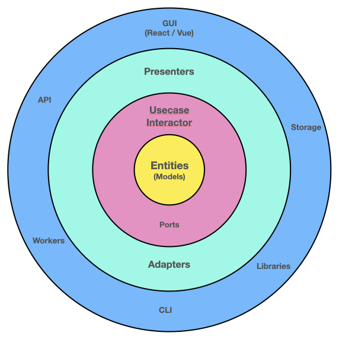

## 클린 아키텍쳐
(feat. React)

`Sangwon Lee`

---

### 어디서 시작된거죠?


---

### 시그니쳐 다이어그램


---

### 시그니쳐 다이어그램 (제어 흐름)


---

### 클린 아키텍쳐는 뭐다?

"클린 아키텍쳐는 **의존성 규칙(Dependency Rules)** 에 대한 이야기"

- 동심원 안쪽은 핵심(비즈니스) 로직 - 외부의 변화에 영향 X, 보호 필요

- 동심원 바깥쪽은 상세 구현체 - 핵심 로직에 영향을 주면 X, 변경 가능성 높음

- 의존의 방향은 항상 동심원 바깥에서 안쪽이어야 함
  (동심원 안쪽의 소스가 바깥쪽의 소스를 직접 의존 절대 X)

---

### 클린 아키텍쳐 뿐인가?

Hexagonal Architecture (Ports-Adapters)


---

### 클린 아키텍쳐 뿐인가?

Domain Driven Design


---

### 아키텍쳐는 뭐다?

"아키텍쳐는 **의존성 규칙(Dependency Rules)** 에 대한 이야기"

- 고수준(핵심 로직)과 저수준(상세)를 잘 분리하고 이들간의 의존 관계를 정리

- 고수준의 로직을 저수준의 변경사항으로부터 보호하기

  *“Depend upon abstractions, not concretions.”*

---

### 사례 - DIP

**Dependency Inversion Principle** in SOLID
(with DI technique)


---

### 사례 - IoC

**Inversion of Control**

a.k.a Hollywood Principle – *“Don’t call us, We will call you.”*

---

### 사례 - IoC

Callback

```js
function processTurn(card, goOrStop) {
  // 패 뒤집고, 점수 계산하고
  if (scored && !goOrStop()) {
    finishTurn()
  } else {
    nextTurn()
  }
}

processTurn(cardGodori, () => askUserToGoOrStop())
processTurn(cardHongdan, () => decisionByAlphaGoStop())
```

---

### 사례 - IoC

Template Method (GoF Design Patterns)

```ts
abstract class Robot {
  head: Head;
  body: Body;

  build(): void {
    this.head = this.createHead();
    this.body = this.createBody();
  }

  abstract createHead(): Head;
  abstract createBody(): Body;
}
```

---

### 사례 - IoC

Template Method (GoF Design Patterns)

```ts
class FlyingRobot extends Robot {
  createHead(): Head { return ... }
  createBody(): Body { return ... }
}

class WalkingRobot extends Robot {
  createHead(): Head { return ... }
  createBody(): Body { return ... }
}

const robot = new FlyingRobot();
robot.build();
```

---

### 사례 - IoC

Framework

```js
const express = require('express');
const app = express();

app.get('/', (req, res) => {
  res.send('Hello World!');
});

app.use((req, res, next) => {
  console.log('Time:', Date.now());
  next();
});
```

---

### 리액트와 클린 아키텍쳐

- 리액트 안에서 생각하기

- 리액트 밖에서 생각하기

---

### 클린 아키텍쳐 - 리액트 안에서 생각하기


---

### 클린 아키텍쳐 - 리액트 안에서 생각하기

사례 - Hook을 통한 저수준 모듈 접근 (DI through Hook)

```js
const TodoBoardCotainer = () => {
  const api = useApi();
  const tasks = useTasks();

  const onTaskAdded = async () => {
    await api.createTask(...);
    tasks.add(...);
  };

  return <TodoBoard ...
};
```

---

### 클린 아키텍쳐 - 리액트 안에서 생각하기

사례 - Hook을 통한 저수준 모듈 접근 (DI through Hook)

```js
// import apiv1 from '@/helpers/apiv1';
import apiv2 from '@/helpers/apiv2';

const useApi = () => {
  // 훅에서 저수준 모듈을 직접 접근하지만
  // 이 Hook을 쓰는 입장에서는 영향을 받지 않음 (마치 DI가 이뤄진 것처럼)
  return apiv2;
};
```

---

### 클린 아키텍쳐 - 리액트 안에서 생각하기

사례 - Hook을 통한 상태 및 액션 제공 (구체적인 상태관리시스템 감추기)

```js
import { useDispatch, useSelector } from 'react-redux';

const useTasks = () => {
  const dispatch = useDispatch();
  const tasks = useSelector(states => states.tasks);
  return {
    add: (task) => dispatch.addTask,
    ...
  };
};
```

---

### 클린 아키텍쳐 - 리액트 안에서 생각하기

사례 - Container와 Presentational Component의 느슨한 관계 만들기

```js
import TodoBoard from '@/components/TodoBoard';

const TodoBoardContainer = () => {
  ...

  return <TodoBoard ...
};
```

---

### 클린 아키텍쳐 - 리액트 안에서 생각하기

사례 - Container와 Presentational Component의 느슨한 관계 만들기

```js
// @/components/TodoBoard/index.js
import MuiTodoBoard from './MuiTodoBoard';  // './AntdTodoBoard';
export default MuiTodoBoard;
```

```js
// @/components/TodoBoard/MuiTodoBoard.js
import Table from '@mui/material/Table';
const TodoBoard = () => {
  ...
  return <Table ... />
};
export default TodoBoard;
```

---

### 클린 아키텍쳐 - 리액트 밖에서 생각하기



---

### 클린 아키텍쳐 - 리액트 밖에서 생각하기

사례 - GUI 라이브러리 의존성 분리 (React/Vue as a just view library)

```js
const TodoBoardContainer = () => {
  const interactor = useInteractor();
  const tasks = useObservableState(states => states.tasks);

  const onTaskAdded = () => {
    interactor.addTask(...);
  };

  return {tasks.map(...)};
};
```
---

### 클린 아키텍쳐 - 리액트 밖에서 생각하기

사례 - GUI 라이브러리 의존성 분리 (React/Vue as a just view library)

```js
import diContainer from '@/di/container';
const useInteractor = () => {
  return diContainer.get('interactor');
}

const useObservableState = (selector) => {
  const [state, setState] = useState();
  const stateManager = diContainer.get('stateManager');
  stateManager.listen(states => setState(selector(states)));
  return state;
}
```

---

### 참고
- https://dev.to/bespoyasov/clean-architecture-on-frontend-4311
- https://khalilstemmler.com/articles/software-design-architecture/domain-driven-design-vs-clean-architecture