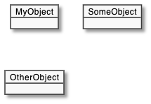
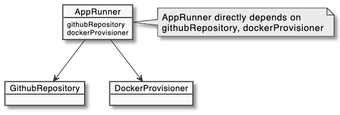
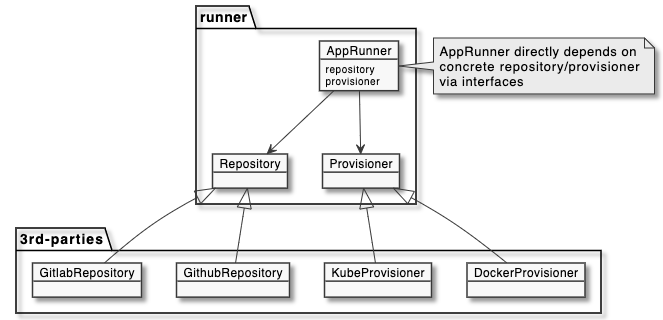

## DI in Typescript

`Sangwon Lee`

---

### What is **DI**?

**Dependency Injection**

> _In software engineering, **dependency injection** is a technique in which an object receives other objects that it depends on, called dependencies. Typically, the receiving object is called a client and the passed-in ('injected') object is called a service. The code that passes the service to the client is called the injector. -- [wikipedia](https://en.wikipedia.org/wiki/Dependency_injection)_

`#dependencies` `#client` `#service` `#inejcted` `#injector`

---
### What is **Dependencies**?

- Nothing depends on each other



---
### What is **Dependencies**?

- `AppRunner` has dependencies on
  - `GithubRepository`
  - `DockerProvisioner`



---
### What is **Dependencies**?

- In code,

```ts
// runner.ts
import GithubRepository from 'libs/GithubRepository';
import DockerProvisioner from 'libs/DockerProvisioner';

class AppRunner {
  githubRepository = new GithubRepository(...);
  dockerProvisioner = new DockerProvisioner(...);

  run(appId: string) {
    ...
  }
}
```

---
### Problem?

"Requirements changed.."

- App(Source) Repository
  - Github --> **Gitlab**

- Provision Target
  - Docker --> **Kubernetes**

---
### Problem solved

```ts
// runner.ts
import GitlabRepository from 'libs/GitlabRepository';
import KubeProvisioner from 'libs/KubeProvisioner';

class AppRunner {
  gitlabRepository = new GitlabRepository(...);
  kubeProvisioner = new KubeProvisioner(..);

  run(appId: string) {
    ...
  }
}
```

So far so good.

---
### Problem?

"Need to distribute `AppRunner` package to 3rd-parties"
  - with encapsulating its implementation
  - so that 3rd-parties cannot modify `AppRunner` core logic
  - but allowing them to extend repository and provisioner


---
### Yes, Dependency Injection



---
### Declare **interface**

```ts
// runner.ts
export interface Repository {
  pull(repo: string, rev: string): void;
}

export interface Provisioner {
  provision(key: string, options: ProvisionOptions): void;
}
```

---
### Decoupling dependencies by **interface**

```ts
// runner.ts
export class AppRunner {
  constructor(
    private repository: Repository,
    private provisioner: Provisioner
  )

  run(appId: string) {
    ...
  }
}
```

---
### Define **service(injected)** by implementing interfaces
```ts
// third.ts
import { Repository, Provisioner }  from 'runner';

export class GitlabRepository implements Repository {
  pull(repo: string, rev: string): void {
    ...
  }
}

export class KubeProvisioner implements Provisioner {
  provision(key: string, options: ProvisionOptions): void {
    ...
  }
}
```

---
### Inject dependencies to **client**
```ts
// main.ts
import { GitlabRepository, KubeProvisioner } from 'third';

// const runner = new AppRunner(
//   new GithubRepository(...),
//   new DockerProvisioner(...)
// );
const runner = new AppRunner(
  new GitlabRepository(...),
  new KubeProvisioner(...)
);

runner.run('sangwonl/my-app');
```

---
### DIP(SOLID) vs **DI**

SOLI**D** - Dependency Inversion Principle
- High-level modules should not import anything from low-level's
- Abstractions should not depend on details

So, **DI is a technique or practice of DIP**


---
### Other definition of **DI**

One of the best definition is by [James Shore](https://www.jamesshore.com/v2/blog/2006/dependency-injection-demystified):

> _"Dependency Injection" is a 25-dollar term for a 5-cent concept. Dependency injection means giving an object its instance variables._

```ts
class TeslaModel3 {
  constructor(color: string) { ... }

  setBatteryCapacity(cap: number): void { ... }
}
```

---
### DI Tools for Typescript
- [inversify/InversifyJS](https://github.com/inversify/InversifyJS)
  - Reflection in runtime
  - Using decorator, relatively verbose

- [wessberg/DI](https://github.com/wessberg/DI)
  - Reflection in compile(transform)-time
  - Less injection codes, it just works

---
### Examples - Inversify
Installation
```bash
$ npm install inversify reflect-metadata --save
```
Decorator related options `tsconfig.json`
```ts
// Important! InversifyJS requires
// TypeScript >= 4.4 and the experimentalDecorators, emitDecoratorMetadata, types and lib in your typescript compilation options.
{
  "compilerOptions": {
    "target": "es5",
    "module": "commonjs",
    "moduleResolution": "node",
    "lib": ["es6"],
    "types": ["reflect-metadata"],
    "experimentalDecorators": true,
    "emitDecoratorMetadata": true
  }
}
```

---
### Examples - Inversify
Define symbols
```ts
// types.ts
const TYPES = {
  Repository: Symbol.for('Repository'),
  Provisioner: Symbol.for('Provisioner'),
};

export { TYPES };
```

---
### Examples - Inversify
Define concrete classes
```ts
// third.ts
import { injectable } from 'inversify';
import { Repository, Provisioner }  from 'runner';

@injectable()
export class GitlabRepository implements Repository {
  pull(repo: string, rev: string): void { ... }
}

@injectable()
export class KubeProvisioner implements Provisioner {
  provision(key: string, options: ProvisionOptions): void { ... }
}
```

---
### Examples - Inversify
Declare dependencies (to be injected) in the constructor
```ts
// runner.ts
import { injectable, inject } from 'inversify';
import { TYPES } from 'types'

@injectable()
export class AppRunner {
  constructor(
    @inject(TYPES.Repository) private repository: Repository,
    @inject(TYPES.Provisioner) private provisioner: Provisioner
  )
}
```

---
### Examples - Inversify
Registration to DI container
```ts
// di.ts
import 'reflect-metadata';
import { Container } from 'inversify';
import { TYPES } from 'types';
import { Repository, Provisioner, AppRunner } from 'runner';
import { GithubRepository, KubeProvisioner } from 'third';

const container = new Container();
container.bind<Repository>(TYPES.Repository).to(GithubRepository).inSingletonScope();
container.bind<Provisioner>(TYPES.Provisioner).to(KubeProvisioner).inSingletonScope();
container.bind<AppRunner>(AppRunner).toSelf().inSingletonScope();

export default container
```

---
### Examples - Inversify
Get dependencies injected instance
```ts
// main.ts
import container from 'di';
import { AppRunner } from 'runner';

const runner = container.get(AppRunner);
runner.run('sangwonl/my-app');
```

---
### Examples - wessberg/DI
Installation
```bash
$ npm install @wessberg/di
```

Declare dependencies (to be injected) in the constructor
```ts
// runner.ts
export class AppRunner {
  constructor(
    private repository: Repository,
    private provisioner: Provisioner
  )
}
```
---
### Examples - wessberg/DI
Registration to DI container
```ts
// di.ts
import { DIContainer } from '@wessberg/di';
import { Repository, Provisioner, AppRunner } from 'runner';
import { GithubRepository, KubeProvisioner } from 'third';

const container = new DIContainer();
container.registerSingleton<Repository, GithubRepository>();
container.registerSingleton<Provisioner, KubeProvisioner>();
container.registerSingleton<AppRunner>();

export default container
```

---
### Examples - wessberg/DI
Get dependencies injected instance
```ts
// main.ts
import container from 'di';
import { AppRunner } from 'runner';

const runner = container.get<AppRunner>();
runner.run('sangwonl/my-app');
```

---
### References
- https://stackoverflow.com/questions/130794/what-is-dependency-injection
- https://www.jamesshore.com/v2/blog/2006/dependency-injection-demystified
- https://en.wikipedia.org/wiki/Dependency_injection