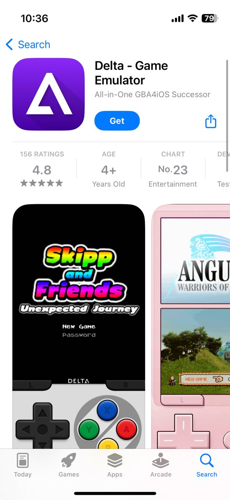
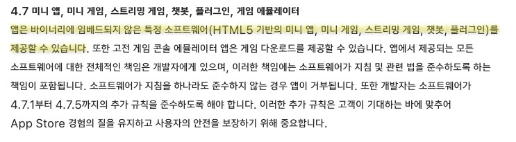
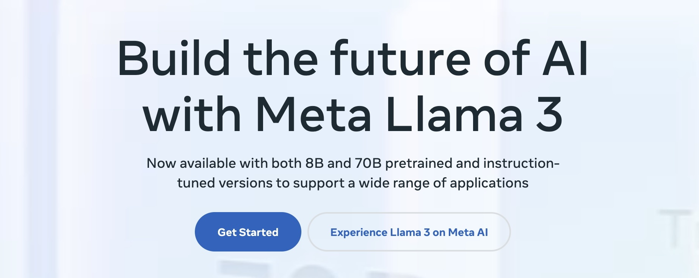
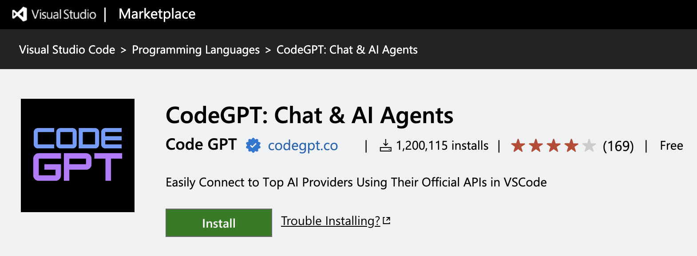
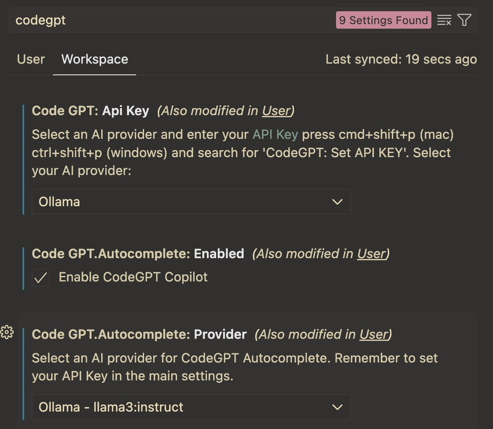
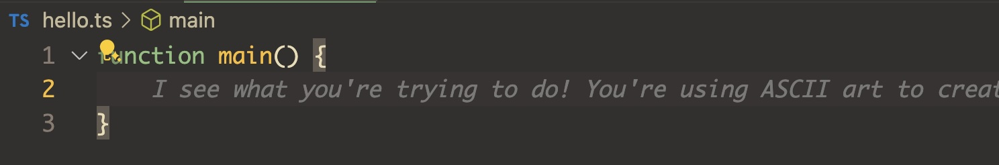
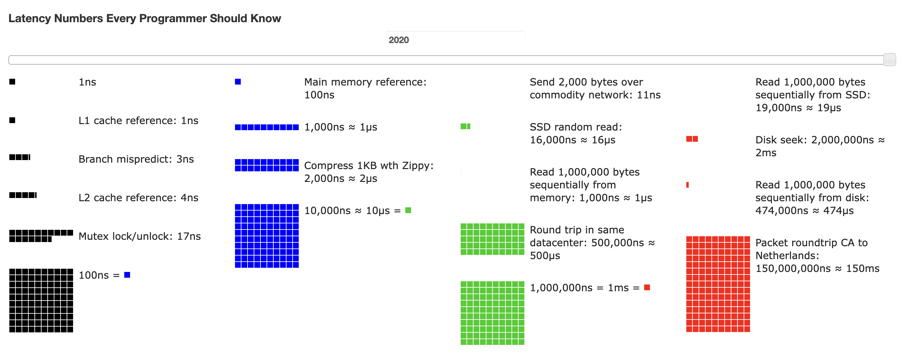
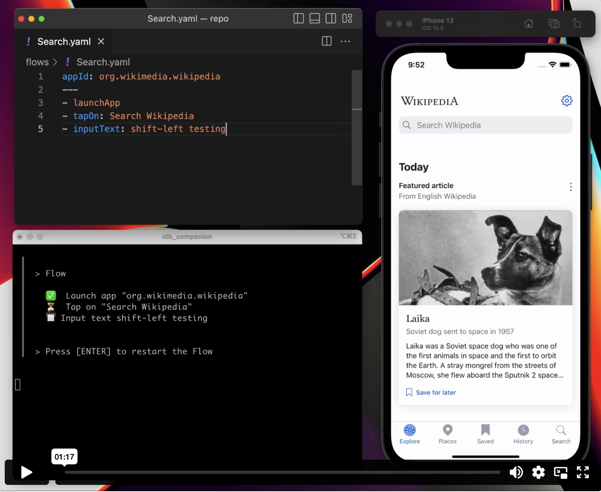
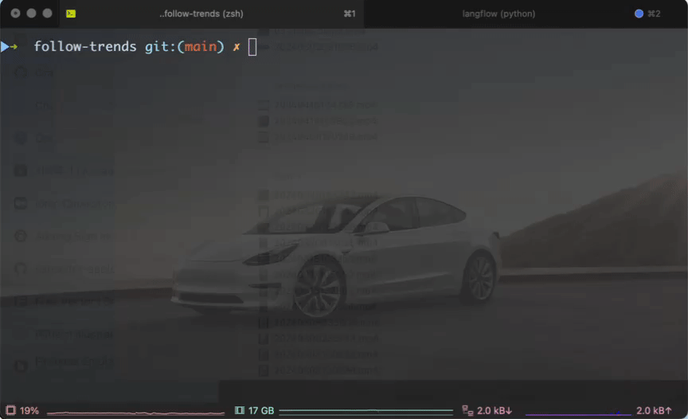

## Monthly Trend Picks
2024-04

`gamz`

###
_Retro game console on iOS_

_Llama3 for code assistant_

_Numbers frontend engineers should know_

_Open Source 소식 이모저모_


---
#### Retro game console on iOS

 

---
#### Retro game console on iOS

https://github.com/rileytestut/Delta

> Delta is an all-in-one classic video game emulator for non-jailbroken iOS devices.

_Supported Systems_
- Nintendo Entertainment System (NES)
- Super Nintendo Entertainment System (SNES)
- Nintendo 64 (N64)
- Game Boy / Game Boy Color (GBC)
- Game Boy Advance (GBA)
- Nintendo DS (DS)
- Sega Genesis / Mega Drive (GEN) (in beta)

---
#### Retro game console on iOS (데모)

[Demo video](./res/03-delta-demo.mp4)

[Full video from Youtube](https://www.youtube.com/watch?v=uSinT_-vPqU)

---
#### Retro game console on iOS (앱스토어가?)

###
`사이드로딩(Sideloading)`

- 파일이나 소프트웨어를 한 장치에서 다른 장치로 이동시키는 일
- 스마트폰 앱이라면 공식적인 앱 마켓을 거치지 않고 기기 제조업체가 승인하지 않은 앱을 설치
- 애플은 이런 사이드로딩을 적극적으로 허용하지 않았음

####
그런데 [지난 4월 5일 애플 앱 리뷰 가이드라인 업데이트](https://developer.apple.com/news/?id=0kjli9o1)에 4.7 항목이 추가됨



---
#### Retro game console on iOS (배경)

###
_반독점 압력 증가_
- 애플의 제한적 관행으로 인해 미국과 EU에서 반독점 소송과 조사가 이루어졌음
- 에픽게임즈는 2020년 앱스토어 수수료 구조에 대해 애플을 고소했고, EU의 규제 당국은 대형 기술 기업을 규제하는 법안을 통과시켰음
- 2023년 미국 법무부는 애플이 스마트폰 시장에서 불법적인 독점 행위를 했다며 반독점 소송을 제기했음
- 애플은 제3자 앱스토어와 결제 방식을 허용하는 등 일부 변화를 시작했지만, 개발자와 규제 당국의 반발은 계속되고 있음

---
#### Retro game console on iOS (배경)

###
_EU, DMA (Digital Markets Act) 규정 준수 의무화_
- 애플이 유럽연합(EU)의 반독점 지침에 따라 앱 스토어 가이드라인을 업데이트
- 3월 iOS 17.4 출시와 함께 EU의 아이폰은 DMA 규정을 적용받기 시작
- 애플이 대체 앱스토어, 앱 사이드로딩, 서드파티 브라우저 엔진 등을 iOS에서 처음으로 지원하도록 강제하는 내용을 포함

---
#### Retro game console on iOS (인사이트)

###
_변화 예상 및 한계_
- 아이패드의 큰 화면(데스크톱급 M 시리즈 칩)에서 대체 앱스토어와 브라우저 엔진을 사용할 수 있게 되면, Mac 사용자들이 시스템에서 할 수 있는 일을 더 많이 할 수 있게 되어 태블릿이 더 나은 노트북 대체품이 될 수 있음
- 하지만 대체 앱스토어나 서드파티 웹사이트를 통해 배포되는 앱은 애플의 많은 규칙을 따라야 하며, 여전히 애플의 공용 API 사용에 제한을 받을 것으로 예상
- 또한 미국 기반 아이폰이나 아이패드 사용자에게 직접적인 영향을 미치지 않음 (이들 기기는 여전히 애플의 앱스토어와 WebKit 브라우징 엔진으로 제한됨)

---
#### Retro game console on iOS (참고):

- https://www.lifewire.com/ipad-as-retro-games-console-8640899
- https://news.hada.io/topic?id=14196
- https://news.hada.io/topic?id=14587
- https://m.blog.naver.com/tech-plus/222417730934
- https://arstechnica.com/apple/2024/04/apple-must-open-ipados-to-sideloading-within-6-months-eu-says/

---
### Llama3 for code assistant (Llama3)



---
### Llama3 for code assistant (Llama3)

- Llama 3는 현재 출시된 8B, 70B와 아직 학습 중인 405B 크기의 Dense 모델로 제공
- 멀티모달, 멀티언어, 더 큰 컨텍스트 창을 갖춘 새로운 릴리스의 로드맵을 가지고 있으며, 올해내로 405B를 롤아웃할 예정
- 405B는 현재 훈련중인 상태로 85 MMLU에 도달했으며, 여러 벤치마크에서 선두를 차지할 것으로 예상
- 8B Llama 3 모델은 최대 크기의 Llama 2 모델과 거의 동등한 성능을 가짐
- 70B도 훌륭해서 이미 82 MMLU임

###
※ MMLU: Massive Multitask Language Understanding
- Claude3 (86.8), GPT-4 (86.4), Gemini Ultra (83.7)

---
### Llama3 for code assistant (왜 공개?)

- 모바일 생태계가 짜증나는 것은 애플과 구글이라는 두개의 게이트키퍼 회사가 있다는 것, 이들 포함 다른 어떤 회사도 우리가 무엇을 만들 수 있는지 알려주는 것을 원하지 않음
- 데이터베이스나 캐싱 시스템 또는 아키텍처처럼 커뮤니티로부터 더 나은 제품을 만드는 데 도움이 되는 귀중한 기여를 얻을 수 있는 경우가 많다고 생각
- Llama 여러 면에서 매우 허용적인 오픈 소스 라이선스, 하지만 Microsoft Azure 또는 Amazon 과 같은 클라우드 제공자가 모델을 재판매하려면 그에 대한 수익 공유가 있어야 함 (모델 자체가 제품이기도 함)

---
### Llama3 for code assistant (현황)

- 모델이 120만회 이상 다운로드되었고, Hugging Face에서 개발자들이 600개 이상의 파생 모델을 공유했음
- Llama 3 GitHub 레포지토리가 17,000개 이상의 별을 받았음
- LMSYS Chatbot Arena 리더보드에서 Llama 3 70B Instruct 모델이 영어 전용 평가에서 1위를 차지했고, 전체적으로는 6위를 기록해 공개된 모델 중 가장 높은 순위를 차지했음 (폐쇄적인 독점 모델에 이어)
- 실리콘, 하드웨어, 클라우드 제공업체 파트너들이 Llama 3를 사용자에게 배포하기 시작했음
- 향후 몇 달 동안 멀티모달, 다국어 대화, 더 긴 컨텍스트 창, 전반적인 기능 향상 등 새로운 기능을 갖춘 모델을 공개할 예정임

---
### Llama3 for code assistant (Ollama)

[Ollama](https://ollama.com)

```bash
$ brew install ollama
$ ollama run llama3
pulling manifest
pulling 00e1317cbf74... 100% ▕█████████████████████████████████████████████████████████████▏ 4.7 GB
pulling 4fa551d4f938... 100% ▕█████████████████████████████████████████████████████████████▏  12 KB
pulling 8ab4849b038c... 100% ▕█████████████████████████████████████████████████████████████▏  254 B
pulling 577073ffcc6c... 100% ▕█████████████████████████████████████████████████████████████▏  110 B
pulling ad1518640c43... 100% ▕█████████████████████████████████████████████████████████████▏  483 B
verifying sha256 digest
writing manifest
removing any unused layers
success
>>> I have 5 apples now, I ate 3 apples yesterday. How many do I have now?
...
Let's work it out!

You had 5 apples initially. You ate 3 apples yesterday.

To find out how many you have now, subtract the number of apples you ate from the initial amount:

5 (initial) - 3 (eaten) = 2 So, you have 2 apples left!

>>> Send a message (/? for help)
```

---
### Llama3 for code assistant (CodeGPT)

[CodeGPT](https://marketplace.visualstudio.com/items?itemName=DanielSanMedium.dscodegpt)



---
### Llama3 for code assistant (CodeGPT)

```bash
$ ollama pull llama3:8b
$ ollama pull llama3:instruct
```



---
### Llama3 for code assistant (CodeGPT)

###


---
### Llama3 for code assistant (참고)

- [Llama3 주크버그 인터뷰 요약](https://news.hada.io/topic?id=14427)
- https://ollama.com/
- https://codegpt.co/
- https://www.linkedin.com/pulse/use-llama-3-locally-visual-studio-code-paul-hankin-brpre/

---
### Numbers frontend engineers should know



---
### Numbers frontend engineers should know

|Metric|Estimate|MetricImpact|
|------|--------|------------|
|Wifi latency to internet|1-4ms|TTFB,FCP,LCP|
|5G high-band (millimeter wave) latency to internet|1-5ms|TTFB,FCP,LCP|
|LTE latency to internet|15-50ms|TTFB,FCP,LCP|
|3G latency to internet|150ms|TTFB,FCP,LCP|
|User-space budget per frame for 60 frames per second|5-10ms|Smooth framerate
|Time to parse 1MB of CSS|100ms|FCP,LCP|
|Time to parse 1MB of HTML|120ms|FCP,LCP|
|Time to parse 1MB of JS|150ms|FCP,LCP,INP|

---
### Keywords frontend engineers should know (Handbook)

[The Front End Developer/Engineer Handbook 2024](https://frontendmasters.com/guides/front-end-handbook/2024/#6.36)

---
### Keywords frontend engineers should know (참고)

- https://vercel.com/blog/latency-numbers-every-web-developer-should-know
- https://colin-scott.github.io/personal_website/research/interactive_latency.html
- https://frontendmasters.com/guides/front-end-handbook/2024/#6.39

---
### Open Source 소식 이모저모 (Redis)

지난 3월 20일,
> Beginning today, all future versions of Redis will be released with source-available licenses. Starting with Redis 7.4, Redis will be dual-licensed under the Redis Source Available License (RSALv2) and Server Side Public License (SSPLv1). Consequently, Redis will no longer be distributed under the three-clause Berkeley Software Distribution (BSD).

- Redis 7.4부터 모든 미래 버전의 Redis는 Redis Source Available License (RSALv2)와 Server Side Public License (SSPLv1) 하에 이중 라이선스 됨
- 라이선스 변경으로 인해 Redis 이용자와 Redis 를 이용한 라이브러리들은 영향을 받지 않지만, 클라우드 업체들이 Redis 를 호스팅해주는 서비스들이 제한받게 됨

---
### Open Source 소식 이모저모 (Redis)

- MS - [garnet](https://github.com/microsoft/garnet)
- AWS, Ericsson, Google Cloud, Oracle, Verizon - [valkey](https://github.com/valkey-io/valkey)
- 많은 주요 Redis 고객사들이 Valkey로 옮겨감에 따라 Redis Labs 사는 심각한 도전에 직면함
	- antirez가 몇 년 전 Redis 개발에서 은퇴함
	- 이제 사용자 기반이 충성심을 유지할 만한 이유가 거의 없음

---
### Open Source 소식 이모저모 (xz 오픈소스 해킹)

https://news.hada.io/topic?id=14122

- 2년 넘게 "Jia Tan"이라는 이름을 사용하는 공격자가 xz 압축 라이브러리에 성실하고 효과적인 기여자로 활동하여 최종적으로 커밋 권한과 관리자 권한을 부여받음.
- 그 권한을 사용하여 Debian, Ubuntu, Fedora 및 기타 systemd 기반 Linux 시스템에서 OpenSSH sshd의 종속성이기도 한 xz의 일부인 liblzma에 매우 미묘하고 주의 깊게 숨겨진 백도어를 설치함.
- 이 백도어는 SSH 세션 시작 시 공격자가 숨겨진 명령을 보내는 것을 감시하여, 로그인하지 않고도 대상 시스템에서 임의의 명령을 실행할 수 있는 기능을 공격자에게 제공함. 인증되지 않은 대상 원격 코드 실행임.
- 이 공격은 2024년 3월 29일 공개적으로 공개되었으며, 널리 사용되는 오픈소스 소프트웨어에 대한 최초의 심각한 공급망 공격으로 보임.
- 오픈소스 공급망 보안에 있어 분수령이 될 사건임.

---
### Open Source 소식 이모저모 (Windows on ARM)

https://news.hada.io/topic?id=14253

- Microsoft, 퀄컴과 협력하여 윈도우 온 ARM으로 애플에 도전
- 마이크로소프트는 퀄컴의 차기 스냅드래곤 X 엘리트 프로세서를 탑재한 ARM 기반 윈도우 노트북이 CPU 성능과 AI 가속 작업에서 애플 M3 맥북 에어를 능가할 것이라 확신하고 있음
- 새 윈도우 AI PC는 "Rosetta 2보다 더 빠른 앱 에뮬레이션"을 가지게 될 것 (10년 동안 허들이었고, 2년전부터 Windows 11에 에뮬레이션 제공)
- 마이크로소프트는 인텔 코어 울트라 프로세서 대신 퀄컴의 스냅드래곤 X 엘리트 프로세서를 탑재한 서피스 프로 10과 서피스 랩톱 6의 소비자 모델을 출시할 계획임


---
### Open Source 소식 이모저모 (Maestro)

> [Maestro](https://maestro.mobile.dev/) is the simplest and most effective mobile UI testing framework.




---
### Open Source 소식 이모저모 (Terminal Shop)

https://www.terminal.shop/



---
### Open Source 소식 이모저모 (참고)

- [Redis Dual Source-Available Licensing](https://news.hada.io/topic?id=13942)
- [Valkey](https://news.hada.io/topic?id=14436)
- [SSPL](https://news.hada.io/topic?id=14094)
- [Antirez 레디스를 떠나며](http://antirez.com/news/133)
- https://maestro.mobile.dev/
- https://www.terminal.shop/
