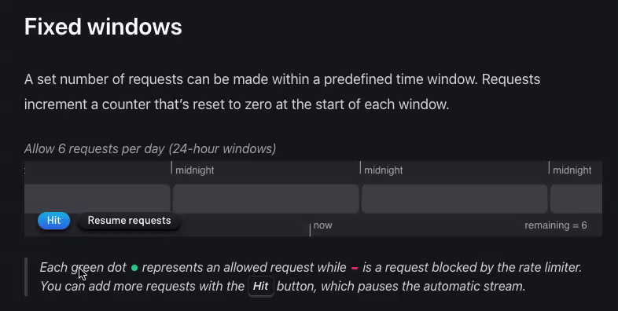
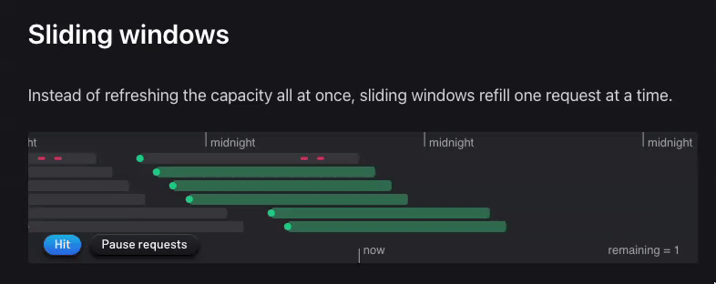
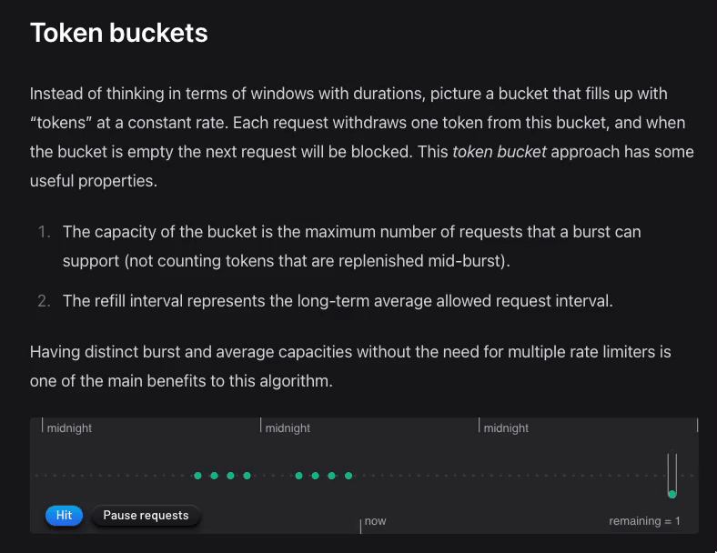
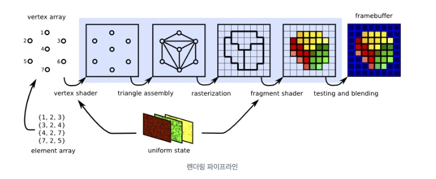

## Monthly Trend Picks
2024-05

`gamz`

###
_#뉴스_

_#기술_

_#오픈소스_

---
## #뉴스 [구글 Search API 문서 유출](https://news.hada.io/topic?id=15074)

- 구글 팀원들이 프로젝트에 사용 가능한 데이터 요소를 이해하도록 돕기 위한 문서임
- 유출 경로: GitHub에 잠시 공개되었고, 이 기간 동안 문서가 유출됨
- Navboost와 클릭 데이터 활용:
  - 구글은 클릭 데이터를 필터링하여 랭킹 시스템에 포함할 클릭을 선별
  - 클릭 길이와 노출 횟수를 측정해 검색자 만족도를 평가

- Chrome 브라우저 클릭스트림 활용:
  - 구글은 Chrome 클릭 데이터를 사용해 Sitelinks를 결정
  - 이는 웹사이트의 인기 있는 URL을 선정하는 데 활용

---
## #뉴스 [구글 Search API 문서 유출](https://news.hada.io/topic?id=15074)

- 여행, 코로나, 정치 관련 화이트리스트:
  - 특정 도메인을 우선적으로 표시하는 화이트리스트가 존재
  - 이는 여행, 코로나, 선거 관련 검색 결과에 적용

- 품질 평가자 피드백 활용:
  - 품질 평가자의 평가가 검색 시스템에 직접적으로 사용
  - 이는 검색 결과의 품질을 개선하는 데 기여

- 링크 랭킹 가중치 결정에 클릭 데이터 사용:
  - 구글은 클릭 데이터를 통해 링크 인덱스를 품질별로 분류
  - 이는 고품질, 중간 품질, 저품질 링크를 결정하는 데 사용

---
## #뉴스 [구글 Search API 문서 유출](https://news.hada.io/topic?id=15074)

#### 마케터를 위한 주요 시사점
- 브랜드 중요성: 구글은 큰 브랜드를 우선적으로 랭킹에 반영함
- 일부 SEO가 강조하는 경험, 전문성, 권위, 신뢰성 요소(E-E-A-T)가 직접적으로 랭킹에 반영되지 않을 가능성이 있음
- 사용자 의도와 클릭 패턴이 콘텐츠와 링크보다 더 중요한 랭킹 요소임
- 페이지랭크, 앵커 텍스트 등 전통적인 랭킹 요소의 중요성이 감소하고 있음
- 중소기업과 새 창작자/퍼블리셔에게 SEO는 큰 브랜드와 경쟁하기가 더 어려워짐

** E-E-A-T: Experience, Expertise, Authoritativeness, Trustworthiness

---
#### #뉴스 [닌텐도, Github에 8000건 이상의 DMCA 삭제 요청](https://news.hada.io/topic?id=14656)

#### [yuzu Emulator](https://yuzu.en.uptodown.com/android)

Yuzu (sometimes stylized in lowercase) is a discontinued free and open-source emulator of the Nintendo Switch, developed in C++. Yuzu was announced to be in development on January 14, 2018, 10 months after the release of the Nintendo Switch.

The emulator was made by the developers of the Nintendo 3DS emulator Citra, with significant code shared between the projects. Originally, Yuzu only supported test programs and homebrew.

On February 26, 2024, Nintendo of America filed a lawsuit against Tropic Haze LLC, the legal entity behind Yuzu's development. Development and official distribution of Yuzu ceased on March 4, 2024, after Tropic Haze settled the lawsuit with Nintendo of America for $2.4 million.

---
## #뉴스 [닌텐도, Github에 8000건 이상의 DMCA 삭제 요청](https://news.hada.io/topic?id=14656)

- Nintendo가 Switch 에뮬레이터의 코드를 호스팅하는 8,000개 이상의 GitHub 저장소에 대해 DMCA(Digital Millennium Copyright Act) 통지를 보냄
- Yuzu의 개발자들이 Nintendo와 소송을 빠르게 합의하고 240만 달러를 지불한 지 2개월 만에 이루어진 대대적인 Takedown임
- Nintendo 대변인은 저장소에 포함된 Yuzu 소스 코드가 "Nintendo의 기술 보호 조치를 불법적으로 우회하고 Switch 게임의 불법 복사본을 실행한다"고 주장함
- GitHub는 개발자들이 콘텐츠를 변경할 시간을 가질 것이라고 공지에 적었음

---
## #뉴스 [닌텐도, Github에 8000건 이상의 DMCA 삭제 요청](https://news.hada.io/topic?id=14656)

#### 게임 에뮬레이터의 부활과 Nintendo의 대응
- 게임 에뮬레이터가 최근 부활하고 있는 시기에 Nintendo의 법적 대응이 이루어짐
- 지난달 Apple이 App Store에서 레트로 게임 플레이어에 대한 제한을 완화하여 Delta 에뮬레이터가 App Store 1위에 올랐음
- Nintendo는 에뮬레이터의 전성기가 수익에 위협이 된다고 판단하고 수입 흐름에 가장 즉각적인 위협이 되는 것들을 먼저 제거하기 시작했을 수 있음

---
## #뉴스 [닌텐도, Github에 8000건 이상의 DMCA 삭제 요청](https://news.hada.io/topic?id=14656)

#### 에뮬레이터의 중요성과 Nintendo의 법적 공격에 대한 우려
- Nintendo의 에뮬레이터에 대한 법적 공격은 해적질과 관련이 없는 에뮬레이터의 중요한 사용을 무시하고 있음
- 게임 역사학자들은 에뮬레이터를 게임 보존의 핵심으로 보고 있음
- 에뮬레이터가 없다면 Nintendo와 다른 저작권 소유자들은 미래 세대를 위해 역사의 일부를 쓸모없게 만들 수 있음

---
## #뉴스 [더이상 어떤 핑계도 불가](https://bbs.ruliweb.com/community/board/300143/read/66062611)

---
## #뉴스 [더이상 어떤 핑계도 불가](https://bbs.ruliweb.com/community/board/300143/read/66062611)

---
## #뉴스 [더이상 어떤 핑계도 불가](https://bbs.ruliweb.com/community/board/300143/read/66062611)

---
## #뉴스 [더이상 어떤 핑계도 불가](https://bbs.ruliweb.com/community/board/300143/read/66062611)

---
## #뉴스 [더이상 어떤 핑계도 불가](https://bbs.ruliweb.com/community/board/300143/read/66062611)

---
## #기술 [JWT 사용전 점검](https://news.hada.io/topic?id=15053)

JWT: JSON Web Token
- 헤더, 페이로드, 서명 또는 메시지 인증 코드
- 검증 키를 가진 사람은 페이로드의 진위 여부를 확인할 수 있음

\
JWT의 일반적인 사용 패턴
- JWT는 발행자, 수신자, 주제, 만료 시간 등의 정보를 포함함
- 수신자는 토큰의 디코딩 후, 만료 시간이 지나지 않았는지 확인하고, 인증 대상 확인

---
## #기술 [JWT 사용전 점검](https://news.hada.io/topic?id=15053)

JWT의 장점
- JWT의 주요 장점은 수신자가 사용자 데이터베이스에 연결 없이 토큰의 진위를 확인할 수 있음
- 대규모 설치 환경에서는 인증 서비스가 중앙 사용자 데이터베이스에 접근하는 유일한 서비스

\
로그아웃 및 세션 무효화 문제
- 인증 토큰의 수명이 짧아야 함. 예를 들어, 최대 5분
- 클라이언트는 새로운 인증 토큰을 요청할 수 있는 리프레시 토큰도 발급받음
- 리프레시 토큰이 실제 세션 토큰 역할을 함

---
## #기술 [JWT 사용전 점검](https://news.hada.io/topic?id=15053)

JWT가 필요 없는 경우
- 로그아웃을 구현하려면 유효한 JWT의 허용 목록 또는 취소된 JWT의 거부 목록을 유지해야 함
- 사용자를 차단하려면 데이터베이스에서 "사용자 활성" 플래그를 확인해야 함
- 사용자 객체와 다른 객체 간의 추가 관계가 필요함.
- 데이터베이스와 관련된 작업을 수행함.

위의 조건 중 하나라도 해당된다면, JWT가 필요 없음

---
## #기술 [Rate Limit 알고리즘](https://news.hada.io/topic?id=14869)

왜 사용량 제한을?
- 스패머 차단
- 사용자들에게 공정한 참여 기회 제공
- 가격 정책
- 시스템 부하 제어
- 보안 (브루트 포스 공격 혹은 DDOS)

---
## #기술 [Rate Limit 알고리즘](https://news.hada.io/topic?id=14869)

#### Fixed windows 알고리듬
- 고정된 시간 창(window) 내에서 요청 수가 제한됨
- 각 시간 창의 시작에 요청 카운터가 0으로 재설정됨
- 장점
  - 구현과 이해가 쉬움
  - 사용자에게 예측 가능함
 - 단점
   - 시간 창 끝 무렵에 요청이 시작되면 제한의 최대 2배까지 요청 폭증(burst)이 허용될 수 있음

---
## #기술 [Rate Limit 알고리즘](https://news.hada.io/topic?id=14869)

---
## #기술 [Rate Limit 알고리즘](https://news.hada.io/topic?id=14869)

#### 슬라이딩 윈도우(Sliding windows) 알고리듬
- 용량을 한 번에 모두 새로 고치는 대신, 슬라이딩 윈도우는 한 번에 하나의 요청씩 용량을 채움
- 장점
  - 요청 트래픽의 분포를 부드럽게 함
  - 높은 부하에 적합함
- 단점
  - 고정 시간 창보다 사용자에게 예측 가능성이 떨어짐
  - 각 요청의 타임스탬프를 저장하는 것은 리소스를 더 씀

---
## #기술 [Rate Limit 알고리즘](https://news.hada.io/topic?id=14869)

---
## #기술 [Rate Limit 알고리즘](https://news.hada.io/topic?id=14869)

#### 토큰 버킷(Token buckets) 알고리듬
- 시간 창의 지속 시간 대신, 일정한 속도로 "토큰"으로 채워지는 버킷을 상상함
- 각 요청은 이 버킷에서 하나의 토큰을 인출하고, 버킷이 비어 있으면 다음 요청이 차단됨
- 장점
  - 높은 트래픽의 버스트를 허용하지만 장기 평균 요청 속도를 적용함
  - 사용자에게 더 유연하여 허용 가능한 범위 내에서 트래픽 급증을 허용함
- 단점
  - 고정 시간 창보다 사용자에게 제한 사항과 보충 시간을 전달하기가 더 어려움

---
## #기술 [Rate Limit 알고리즘](https://news.hada.io/topic?id=14869)

---
## #기술 [ASCII 3D 렌더러](https://kciter.so/posts/ascii-3d-renderer/)

---
## #기술 [ASCII 3D 렌더러](https://kciter.so/posts/ascii-3d-renderer/)

- 버텍스 처리 (Vertex processing)
- 래스터화 (Rasterization)
- 프래그먼트 처리 (Fragment processing)

---
## #기술 [ASCII 3D 렌더러](https://kciter.so/posts/ascii-3d-renderer/)

#### 버텍스 처리 (Vertex processing)
- 3D 공간을 2D 스크린으로 옮기는 처리
  - 월드 변환 (World transform)
    - 3D 모델 자체는 로컬 좌표계를 가지고 있음, 이를 월드상의 좌표로 옮기는 작업
	- SRT(Scale x Rotate x Translate) Transform
  - 뷰 변환 (View transform)
    - 어느 좌표에서 어느 시점으로 물체를 바라보는지에 따라 달라지는 뷰
	- 카메라를 기준으로 다른 물체의 좌표를 변환
  - 투영 변환 (Projection transform)
    - 원근감을 표현하기 위한 변환
	- 시야각(FoV), 종횡비(Aspect ratio), 가까운 평면(Near plane), 먼 평면(Far plane)

---
## #기술 [ASCII 3D 렌더러](https://kciter.so/posts/ascii-3d-renderer/)

#### 래스터화 (Rasterization)
- 2D 공간 좌표를 픽셀 좌표로 변환하는 것을 의미
  - 클리핑 (Clipping) - 카메라 밖의 폴리곤 제거
  - 원근 나누기 (Perspective division) - 2D 공간 좌표로 변환
  - 후면 제거 (Back-face culling) - 카메라 시점에서 보이지 않는 물체 뒷면 제거
  - 뷰포트 변환 (Viewport transform) - 2D 공간을 픽셀 좌표로 변환
  - 스캔 변환 (Scan transform) - 픽셀 좌표 사이를 채우는 작업

---
## #기술 [ASCII 3D 렌더러](https://kciter.so/posts/ascii-3d-renderer/)

#### 프래그먼트 처리 (Fragment processing)
- 래스터화를 통해 픽셀로 변환된 좌표에 대한 추가 처리
  - 조명 계산 (Lighting calculation)
  - 텍스처 매핑 (Texture mapping)
  - 알파 블렌딩 (Alpha blending)

---
## #기술 [ASCII 3D 렌더러](https://kciter.so/posts/ascii-3d-renderer/)

#### 래스터화 (Rasterization)

---
## #오픈소스 [GraphQL Yoga](https://the-guild.dev/graphql/yoga-server)

GraphQL 서버를 실행하는 가장 쉬운 방법
- 합리적인 기본값 및 최소한의 설정으로 필요한 모든 것을 포함
- 플랫폼/환경에 구애받지 않는 핸들러도 Export 하므로 자신만의 래퍼를 쉽게 구축할 수 있음
- Subscription 포함: Server-Sent Events를 사용하는 GraphQL 구독 기능 기본 지원
- 모든 GraphQL 클라이언트(Apollo, Relay, Urql...)에서 작동
- GraphQL Multipart Request 스펙 기반 파일 업로드 지원
- Fully typed with TypeScript

---
## #오픈소스 [TerminalTextEffects](https://chrisbuilds.github.io/terminaltexteffects/showroom/)

---
## #오픈소스 [모바일 청첩장](https://github.com/heejin-hwang/mobile-wedding-invitation)

---
## 참고

구글 Search API 문서 유출
https://news.hada.io/topic?id=15074

닌텐도, Github에 8000건 이상의 DMCA 삭제 요청
https://news.hada.io/topic?id=14656

yuzu Emulator
https://yuzu.en.uptodown.com/android

더이상 어떤 핑계도 불가
https://bbs.ruliweb.com/community/board/300143/read/66062611

JWT 사용전 점검
https://news.hada.io/topic?id=15053

---
## 참고

Rate Limit 알고리즘
https://news.hada.io/topic?id=14869

ASCII 3D 렌더러
https://kciter.so/posts/ascii-3d-renderer/

GraphQL Yoga
https://the-guild.dev/graphql/yoga-server

TerminalTextEffects
https://chrisbuilds.github.io/terminaltexteffects/showroom/

모바일 청첩장
https://github.com/heejin-hwang/mobile-wedding-invitation
