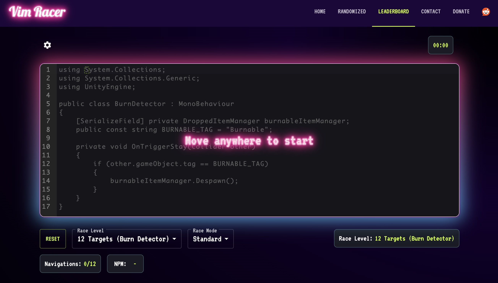
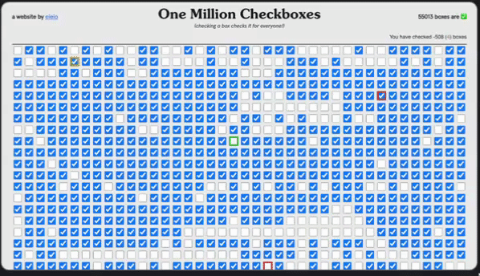

## Monthly Trend Picks
2024-08

`gamz`

###
_#뉴스_

---
# Stack Overflow 개발자 설문 2024

개발자 프로필
- 개발자의 66%가 학사/석사 또는 석사/박사 학위를 가지고 있지만, 학교에서 코딩을 배우는 개발자는 49%에 불과
- 82%의 개발자가 코드를 배우기 위해 가장 많이 선택한 것은 온라인 리소스
- 코드 학습을 위한 최고의 온라인 리소스 : 기술 문서(84%), 스택 오버플로(80%), 글로 된 튜토리얼(68%) 등. AI도 37% 라는게 놀라움
- 개발자 타입 : 풀스택(30.7%), 백엔드(16.7%), 학생(8.6%), 프론트엔드(5.6%)가 상위. 프론트엔드 개발자는 지난해 6.6%에서 5.6%로 감소, 학생과 임베디드 애플리케이션, 학술 연구자 비율은 증가

---
기술
- JavaScript는 2013년과 2014년을 제외하고 매년 가장 인기 있는 프로그래밍 언어로 자리잡음
- 인기 언어 : JavaScript(62.3%), HTML/CSS(52.9%), Python(51%), SQL(51%), TypeScript(38.5%), Rust(12.6%)
- 데이터베이스 : PostgreSQL(48.7%), MySQL(40.3%), SQLite(33.1%), Microsoft SQL Server(25.3%), MongoDB(24.8%)
- 클라우드: Amazon Web Services(48%), Microsoft Azure(27.8%), Google Cloud(25.1%), Cloudflare(15.1%), Firebase(13.9%)
- 웹 프레임워크 및 기술: Node.js(40.8%), React(39.5%), jQuery(21.4%), Next.js(17.9%), Express(17.8%)

---
도구
- 통합 개발 환경: Visual Studio Code(73.6%), Visual Studio(29.3%), IntelliJ IDEA(26.8%), Notepad++(23.9%), Vim(21.6%)
- 비동기 도구: Jira(51.4%), Confluence(31.6%), Markdown 파일(29.1%), Trello(19%), Notion(18.2%)
- 동기식 도구: Microsoft Teams(53.1%), Slack(43.9%), Zoom(40%), Discord(38.4%), Google Meet(37.2%)
- 운영 체제: Windows(개인 59.2%, 업무 47.6%), MacOS(개인 31.8%, 업무 31.8%), Ubuntu(개인 27.7%, 업무 27.7%), Android(개인 17.9%, 업무 8.4%), WSL(개인 17.1%, 업무 16.8%)
- AI 검색 및 개발 도구: ChatGPT(82.1%), GitHub Copilot(41.2%), Google Gemini(23.9%), Bing AI(15.8%), Visual Studio Intellicode(13.6%), Claude(8.1%)

---
AI
- 개발 프로세스에서 AI 도구 사용: 올해 76%가 AI 도구를 사용하거나 사용할 계획이며, 현재 61.8%가 AI 도구를 사용 중
- AI 도구에 대한 의견: 72%가 개발에 AI 도구를 사용하는 것에 대해 긍정적 또는 매우 긍정적인 입장을 보였으며, 이는 작년의 77%보다 감소
- AI 도구의 이점: 생산성 향상(81%), 학습 속도 증가(62.4%), 효율성 증대(58.5%), 코드 정확성 향상(30.3%), 업무량 관리 개선(25%)
- 개발 워크플로우에서 AI 사용: AI 도구를 주로 코드 작성(82%)에 사용, 검색(67.5%), 디버깅 및 도움(56.7%), 코드 문서화(40.1%)에서도 활용. 향후 AI 도구 사용에 관심 있는 부분은 코드 테스트(46%)
- AI 도구가 자신의 직업에 대한 위협인지 여부: 70%의 프로 개발자가 AI를 직업에 대한 위협으로 인식하지 않으며, 전체 응답자의 68.3%가 AI가 직업에 위협이 아니라고 생각

---
근무 관련
- 근무 환경: 하이브리드(42%), 원격(38%), 대면(20%) 근무
- 회사 규모: 응답자의 47%가 100명 미만의 직원이 있는 조직에서 근무하며, 프리랜서(6.1%), 29명(10.4%), 1019명(8.9%), 20~99명(21.2%)
- 개발자 유형별 연봉: 고위 임원($127K), Dev Advocate($124K), 관리자($115K), Dev Ex($109K), SRE($99K), 클라우드 인프라($96K), 블록체인($85K), 보안 전문가($78K), 하드웨어 엔지니어($76K), 데이터 엔지니어($76K)
- 업무 외 코딩의 주요 이유: 취미로 코딩(68.3%), 전문 개발 또는 자기주도 학습(39.5%), 오픈 소스 프로젝트에 기여(25.2%), 프리랜서/계약 작업(19.3%), 사업 구상(15%), 학교나 학업(13%), 업무 외 코딩을 하지 않음(11.9%)

---
# AI 대재앙: 프로젝트의 80%가 실패하고 수십억 달러가 낭비됨
- RAND 연구소의 새 보고서는 AI에 대한 Hype에도 불구하고 대부분의 프로젝트가 실패한다는 것을 보여줌
- RAND: 미국의 대표적인 싱크탱크중 하나. 이름은 R&D를 뜻함. 더글러스항공이 1948년에 설립
- 이 보고서는 65명의 숙련된 데이터 과학자 및 엔지니어와의 인터뷰에 기반하여 이러한 실패의 근본 원인을 밝히고 성공을 위한 로드맵을 제시함

---
### 리더십 실패: 장님이 장님을 인도함
- AI 프로젝트 실패의 가장 큰 원인은 기술이 아닌 최상위 경영진임
- 경영진은 AI로 어떤 문제를 해결해야 하는지 잘못 이해하거나 소통하는 경우가 많음
- 경영진은 AI에 대해 과대 기대를 가지고 있으며, 성공적인 AI 구현에 필요한 시간과 자원을 과소평가함
- 경영진과 기술팀 간의 명확한 의사소통과 프로젝트 목표에 대한 이해 부족으로 AI 이니셔티브는 시작부터 실패할 운명임
- 많은 조직에서 성공적인 AI 구현에 필요한 인내심이 부족함. 프로젝트는 중도에 포기되거나 실제 가치를 입증할 기회도 없이 새로운 우선순위로 전환되는 경우가 많음

---
### 데이터 딜레마: 쓰레기를 넣으면 쓰레기가 나옴
- 데이터 품질은 두 번째로 중요한 장애물로 나타남 "AI의 80%는 데이터 엔지니어링의 지저분한 작업임"
- 많은 조직에서 효과적인 AI 모델을 훈련시킬 만큼 충분한 고품질 데이터가 부족함
- 레거시 데이터셋은 AI 훈련에 적합하지 않을 수 있음
- 데이터 엔지니어 부족은 지식 손실과 프로젝트 비용 증가로 이어짐
- AI 팀 내 도메인 전문성 부족으로 데이터를 잘못 해석하고 모델 설계에 결함이 생길 수 있음

---
### 반짝이는 물건 쫓기: 엔지니어가 집중력을 잃었을 때
- 엔지니어 자신이 프로젝트 실패에 기여하기도 함
- 많은 데이터 과학자와 엔지니어는 더 단순한 솔루션으로 충분함에도 불구하고 최신 기술 발전을 사용하는 데 매력을 느낌
- 이 "반짝이는 물건"을 추구하는 경향은 유지 관리와 이해관계자에게 설명하기 어려운 불필요하게 복잡한 솔루션으로 이어질 수 있음
- 조직은 혁신과 실용성 사이의 균형을 맞춰야 함. 기술 발전을 따라가는 것도 중요하지만 실제 비즈니스 문제를 효과적으로 해결하는 데 주력해야 함

---
### 학계의 관점: 논문으로 발표하거나 사라지거나
- 이 연구는 학계의 AI 연구도 조사했는데, 논문 발표에 대한 압박과 명성 추구가 실제 응용을 압도하는 경우가 많다는 것을 발견함
- "AI 프로젝트가 논문 발표로 이어지지 않으면 성공으로 인식되지 않았다"고 보고서는 지적하며, 학문적 인센티브와 실제 세계 영향 간의 불일치를 강조함
- 이런 논문 발표 중심의 접근은 연구자들이 실제 세계에 상당한 영향을 미칠 수 있는 점진적 개선보다 참신하지만 비현실적인 접근 방식에 우선 순위를 두도록 할 수 있음
- 보고서는 학문적 기관들이 AI 연구에서 성공의 기준을 넓혀, 실질적인 응용이나 산업 협력과 관련된 지표를 포함하는 방안을 고려해야 한다고 제안
- 또한 이 연구는 많은 학계 연구자들이 고품질의 실제 데이터셋에 대한 접근에 어려움을 겪고 있다는 것을 발견함. 이는 학문적 연구와 실제 응용 간의 괴리로 이어질 수 있음
- 보고서는 연구자들에게 필요한 개인 정보 보호 및 보안 조치를 유지하면서 더 관련성 있는 데이터에 대한 접근을 제공하기 위해 학계, 산업계, 정부 기관 간의 협력 증진을 권장함

---
# AI 라벨의 진부함
- "Journal of Hospitality Marketing & Management" 에 발표된 새로운 연구에 따르면, 연구자들은 1,000명의 응답자에게 제품에 대한 질문과 설명을 제시함
- 놀랍게도 AI를 사용한다고 설명된 제품은 일관되게 인기가 낮았음
- 신뢰성이 관점 - 고위험군/저위험군 AI 제품에서 모두 인기 낮음 (고위험군이 물론 조금더 낮음), AI-Powered 라고 하지만 실수를 한다거나 내부 동작에 대한 지식이 부족하면 비신뢰
- 투명성에 대한 이슈
 L 투명성 부족은 브랜드에 대한 고객의 인식을 악화시킬 수 있는 잠재력이 있음
 L 기업은 AI의 기능을 자세히 설명하지 않고 유행어로 "AI" 태그를 붙이는 것을 경계해야 함
 L 단순히 'AI-powered' 또는 'run by AI'라고 말하는 것보다 이것이 어떻게 도움이 될 수 있는지 사람들에게 말하면 소비자의 두려움을 덜어줄 것

---
# 뉴스 독점 소송 (Epic Games)

2020-08-14 iOS용 포트나이트가 퇴출, 같은날 Google Play에서서 퇴출

2020-08-14 이에 Epic Games 는 앱스토어의 [독점 반대운동 영상](https://www.youtube.com/watch?v=EVVTfGmv1BQ&t=48s) 공개

2020-08-29 Epic Games 의 App Store 개발자 계정을 폐쇄

2021-05-03 양사간의 첫 공판 시작, 여론은 Epic Games 편
- 수수료 30% 기준이 뭐냐? (콘솔게임과 비교)
- XBox, Steam 사례로 정당화 시도 (MS 증인으로 나와 반박)
- Spotify 등 그동안 트러블 있었던 회사들이 가세
- 정치권에서의 압박도 있었음

---
2021-09-10 1심 결과
- 소송 10건 중 9건이 Apple 승소
- 포트나이트는 결국 복귀 못 함, 그간의 기회비용도 물어줘야 함
- 서드파티 인앱결제 소송건은 Epic Games 승소 (파급력 있음)
- 외부 페이지로 결제 유도는 OK, 앱내에서 자체 구현한 인앱결제 방식까지 허용인지는 논란

---
2023-04-25 2심 결과
- 1심 판결과 완전 동일, 서드파티 결제는 한번 더 Apple 패소 확인
- 3심 항소심은 기각, Apple 은 Epic Games 에 1000억원 손해배상 청구
- 한편, 구글과의 소송에서는 구글의 여러 반독점 위반에 대한 판단으로 Epic Games 승소
- 구글과 9000억원 상당의 금액으로 합의, 구글도 더 개방적으로 바꾸겠다고 표명

---
2024-03-06 유럽 AppStore 에서 Epic Games 앱장터 거부와 개발자 계정 차단
- EU, DMA (Digital Markets Act) 규정 준수 의무화가 3/7에 시행 예정이었음
- 타사 앱스토어(사이드로딩)를 막는 등의 행위 -> 과징금 연매출의 10%
- Apple 은 이에 앞서 미리 차단한 것으로 추측
- Epic Games 가 EU 집행위원회에 제소하겠다고 하자 고작 몇 시간만에 복구

---
# 뉴스 독점 소송 (Google)

2016-04-20 EU에서 반독점법 위반이라는 결론
- 안드로이드 OS를 탑재한 제조사에게 자사의 검색 엔진과 웹 브라우저를 선탑재하라고 압력

2020-10월 미국 법무부가 반독점법 위반으로 제소
- 2024-08-05 구글 패소

2023-01월 미 법무부 디지털 광고시장 독점 혐의로 제소
2024-09-07 인터넷 검색시장 독점 행위로 제소
- 내년 8월에 쇼부난다고 함
- 크롬/안드로이드를 분리해야하는 것도 고려

---
# 뉴스 독점 소송 (Apple)

2024-03-21 미국 법무부가 Apple을 반독점법 위반으로 제소
- 16개 주의 법무장관과 함께 소송 시작, 이번에 세 번째
- 스마트폰 시장에서 독점적 지위를 이용해 소비자들을 종속
- AppStore 에 30%의 높은 수수료롸 각종 규제를 통해 경쟁사 견제하며 높은 수익 챙김
- 주요 이유
 L WeChat과 같은 슈퍼 앱의 출시 제한
 L Xbox 클라우드 게이밍과 같은 서비스의 앱 스토어 런칭 방해
 L 문자 서비스에 기본 메시지 앱 외의 대안 없으며, iMessage를 안드로이드에서 사용할 수 없음
 L Apple Watch가 아닌 타사 스마트워치와의 연동 제한
 L 제3자의 디지털 지갑 생성을 제한하여 Apple 지갑의 사용을 강요하고 NFC를 개방하지 않음
- 개선시키는게 목표, 불가하다면 회사 분할도 고려

---
# IT 반독점 소송의 원조 (MS)

1994-07-15 미 법무부가 MS 제소 (Sherman법), 주요 쟁점
2000-04-03 잭스판사, MS의 독점금지법 위반 판결.
2000-04-28 법무부 및 17개 주정부, MS 분할안 제출.
2000-06-07 잭슨판사, MS 2개회사로 분할 명령.
2000-06-13 MS, 항소.
2000-09-26 대법원, 법무부 의사와는 달리 MS사건 항소법원 심리 거치도록 결정.
2001-06-28 항소법원, MS 회사분할명령 기각. 사건 지방법원에 환송.

---
### 주요 쟁점 1/2
반경쟁적 수단에 의해 독점력을 유지하였는지
- 관련시장 및 독점력 유무: MS 운영체제의 전세계 시장점유율은 95%를 넘고 있고 Mac OS를 포함한다 하더라도 80%를 넘고 있어 압도적인 시장점유율과 진입에 대한 상당한 장벽의 존재
- 반경쟁적인 수단에 의한 독점력의 유지: 윈도우즈 사용 위해서는 Explorer 의무 사용, Navigator 설치를 곤란하게 만들기, Sun/Java 를 방해하고 호환 안되는 자체 Java 를 보급

---
### 주요 쟁점 2/2
반경쟁적 수단에 의한 2차 시장에서의 독점력획득 기도 여부
- 반경쟁적 행위: Netscape에 윈도우즈용 브라우저기술개발을 포기하도록 제의한 것과 윈도우즈와 explorer를 통합시켜 판매하여 Navigator를 시장에서 몰아내려고 한 행위는 반경쟁적 행위
- 특정 고의: Netscape가 플랫폼수준의 브라우저 개발을 포기하고 시장을 explorer에게 넘겨준다면 MS가 브라우저 시장에서 독점력을 획득할 수 있음을 알고 그러한 결과를 얻기 위해서 의도적으로 한 것으로 이는 특정고의(specific intent)가 있다
- 독점의 우려: MS의 제안당시 Navigator의 시장점유율은 70%를 넘었고 다른 브라우저는 미미했으므로, Navigator가 사라지면 이 시장은 explorer에게 넘어갈 가능성이 컸고, MS는 운영체제 시장에서의 독점력을 지렛대로 사용하여 타 업체의 도전을 물리칠 수 있었던 상황이었으므로 MS의 독점우려

---
# 재미 - [Vim Racer](https://vim-racer.com/)

[demo](res/vim-racer.mp4)

---
# 재미 - OMCB

---
## 참고

Stack Overflow 개발자 설문 2024
https://news.hada.io/topic?id=16217

AI 브랜딩 진부함
https://news.hada.io/topic?id=16312

RAND 보고서
https://news.hada.io/topic?id=16519

MS 반독점 소송 일지
https://www.yna.co.kr/view/AKR20010629001700009

Google 이후의 세상
https://news.hada.io/topic?id=16338

---
## 참고

Vim Racer
https://vim-racer.com/

OMCB (one million checkboxes)
https://news.hada.io/topic?id=16533