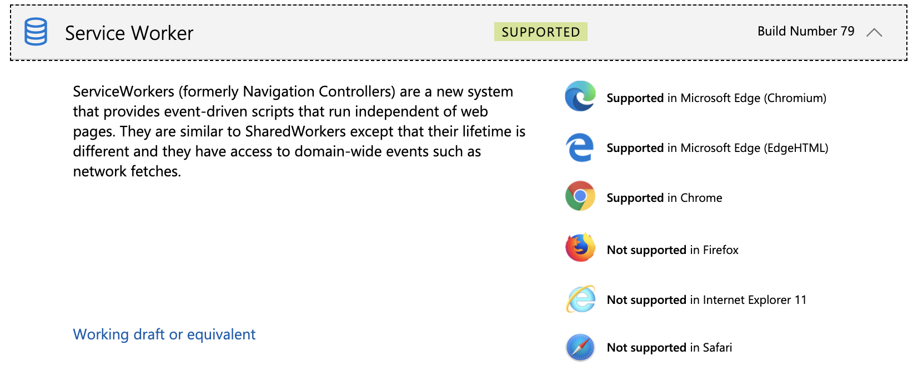
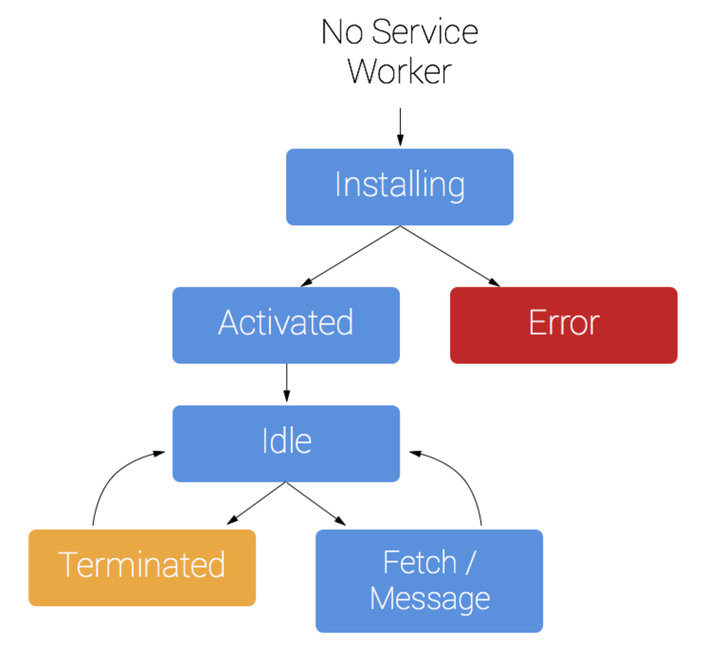
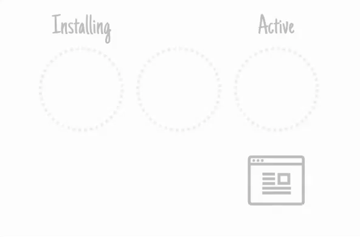
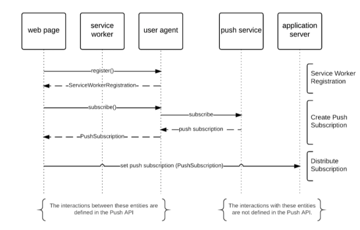
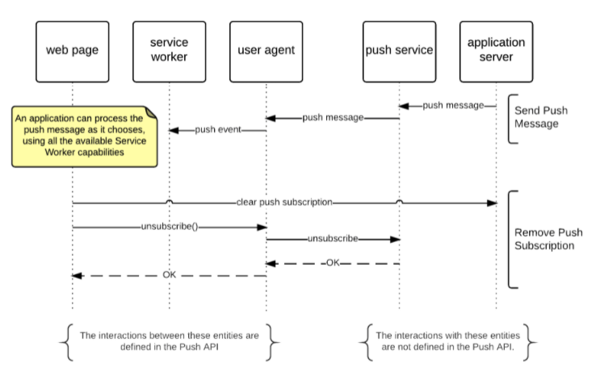

## Service Worker

`Sangwon Lee`

---

### Background

"Desire to build a native application on the web"

- Rich offline experiences
- Periodic background syncs
- Push notifications

---

### What is a service worker?

#### "a script"
- Running in the background
- Separated from a web page
- No need a web page or user interaction

---

### Contents

- Prerequisites
- Things service worker cannot do
- Service worker lifecycle
  - Install to Activate
  - Examples
- Update service worker
- Push notification
  - Examples
- Tips

---

### Prerequisites (Browser)

Most of modern browsers support service worker [...](https://developer.microsoft.com/en-us/microsoft-edge/status/serviceworker/)



---

### Prerequisites (HTTPS)

- HTTPS is required for production
  - because service worker is powerful stuff
  - which can do connection hijack, fabrication, response filter, ...

- But, `localhost` is allowed for development

---

### Things service worker cannot do

- Can't access the DOM directly
  - instead, a service worker can communicate with the pages via `postMessage`
  - web pages receiving message from service worker can manipulate the DOM

- Can't access `Cookies`, `Local Storage` and `Session Storage`
  - to access those storages, should ask web pages via `postMessage`
  - but, can access `IndexedDB` and `Cache Storage`

---

### Service worker Lifecycle



---

### Lifecycle Intent

The intent of the lifecycle is to:

- Make offline-first possible
- Allow a new service worker to get itself ready without disrupting the current one
- Ensure an in-scope page is controlled by the same service worker (or no service worker) throughout
- <ins>Ensure there's only one version of your site running at once</ins>

---

### Lifecycle Brief

Installing to Active



---

### Lifecycle - Install

1. When calling `register()`, service worker is downloaded, parsed and executed. (If the script fails to do those initial operations, the register promise rejects)

2. `install` event is the first event service worker gets and it only happens once. (If you alter service worker script the browser considers there's a new version of service worker)

3. A promise passed to `installEvent.waitUntil()` signals success or failure of the service worker install then the web page can get the result. (It's the proper position to cache your data in advance)

---

### Lifecycle - Active

1. Once install has been completed and it is _ready_, service worker will get an `activate` event. (From now, service worker can control clients or handle functional events like `push` and `sync`)

- _ready_ means
  - When all the pages old service worker serves are closed
    - the old service worker is killed since it doen't need anymore
  - When calling `skipWaiting()` at install event callback

---

### Lifecycle - Active

2. Getting `activate` event itself doesn't mean the page that called `register()` will be controlled.

- So to take control of uncontrolled clients, you need to:
  - Refresh the uncontrolled page so that it connects to the service worker
  - Call `clients.claim()` to take control of all uncontrolled pages right away

---

### Lifecycle - Examples

```js
// @webpage.js
if ('serviceWorker' in navigator) {
  navigator.serviceWorker.register('/sw.js');
}

// @sw.js
self.addEventListener('install', event => {
  console.log('V1 installing…');

  event.waitUntil(
    caches.open('static-v1').then(cache => {
      cache.add('/cat.svg');
    })
  );
});
```

---

### Lifecycle - Examples

```js
// @sw.js
self.addEventListener('activate', event => {
  console.log('V1 now ready to handle fetches!');
});

self.addEventListener('fetch', event => {
  const url = new URL(event.request.url);

  // serve the cat SVG from the cache if the request is
  // same-origin and the path is '/dog.svg'
  if (url.origin == location.origin && url.pathname == '/dog.svg') {
    event.respondWith(caches.match('/cat.svg'));
  }
});
```

---

### Update service worker

1. Update your service worker JavaScript file. When the user navigates to your site, the browser tries to redownload the script file that defined the service worker in the background. **If there is even a byte's difference in the service worker file compared to what it currently has, it considers it new**.

2. Your new service worker will be started and the `install` event will be fired. (At this point the old service worker is still controlling the current pages so the new service worker will enter a `waiting` state)

---

### Update service worker

3. When the currently open pages of your site are closed, the old service worker will be killed and the new service worker will take control.

4. Once your new service worker takes control, its `activate` event will be fired.

So, `activate` event callback is the good position to put your cache management task. On the other side, if you don't need to condsider for the old service worker state you can call `skipWaiting()` on `install` event to activate new one immediately.

---

### Update service worker

```js
// @sw.js
self.addEventListener('activate', event => {
  // want to invalidate caches except for the allowed ones
  const cacheAllowlist = ['pages-cache-v1', 'posts-cache-v1'];

  event.waitUntil(
    caches.keys().then(cacheNames => Promise.all(
      cacheNames.map(cacheName => {
        if (cacheAllowlist.indexOf(cacheName) === -1) {
          return caches.delete(cacheName);
        }
      })
    ))
  );
});
```

---

### Update service worker

```js
// @sw.js
self.addEventListener('install', event => {
  // skip waiting all the old service worker are killed
  // that means new service worker will be activated immediately
  event.waitUntil(self.skipWaiting());
}
```

---

### Update service worker - Advanced

- Check service worker update manually
```js
navigator.serviceWorker.register('/sw.js').then(regstration => {
  // sometime later…
  ..

  registraion.update();
});
```

- Observing whole update cycle

---

```js
navigator.serviceWorker.register('/sw.js').then(reg => {
  reg.installing; // the installing worker, or undefined
  reg.waiting;    // the waiting worker, or undefined
  reg.active;     // the active worker, or undefined

  reg.addEventListener('updatefound', () => {
    const newWorker = reg.installing; // A wild service worker has appeared in reg.installing!

    newWorker.state;
    // "installing" - the install event has fired, but not yet complete
    // "installed"  - install complete
    // "activating" - the activate event has fired, but not yet complete
    // "activated"  - fully active
    // "redundant"  - discarded. Either failed install, or it's been replaced by a newer version

    newWorker.addEventListener('statechange', () => {
      // newWorker.state has changed
    });
  });
});

navigator.serviceWorker.addEventListener('controllerchange', () => {
  // This fires when the service worker controlling this page changes,
  // eg a new worker has skipped waiting and become the new active worker.
});
```

---

### Push notification



---

### Push notification



---

### Push notification - Examples

```js
// @sw.js
function subscribe() {
  // applicationServerPublicKey is used for server to send msg to push service
  // in general, client gets the key from application server
  const serverKeyByteArray = urlB64ToUint8Array(applicationServerPublicKey);
  self.registration.pushManager.subscribe({
    userVisibleOnly: true,
    applicationServerKey: serverKeyByteArray,
  });
```

- `urlB64ToUint8Array` is an util function
- [Spec](https://w3c.github.io/push-api/#pushsubscriptionoptionsinit-dictionary) describes `userVisibleOnly: false`, but major browsers don't seem to support

---

### Push notification - Examples

```js
// @sw.js
self.addEventListener('push', event => {
  const payload = event.data.json();
  const title = payload.title;
  const options = {
    body: payload.body,
    icon: 'images/icon.png',
    badge: 'images/badge.png'
  };

  event.waitUntil(self.registration.showNotification(title, options));
});
```

---

# Tips

---

#### Tips - Accessing service worker registration

- From page
  - Keep result of `register()`
  ```js
  var swRegistration;
  navigator.serviceWorker.register('/sw.js').then(registration => {
    swRegistration = registration;
  });
  ```
  - Query service worker which is `ready`
  ```js
  navigator.serviceWorker.ready.then(registration => {
    registration.active.postMessage(...);
  });
  ```
---

#### Tips - Accessing service worker registration

- From service worker
  - Just use `self.registration`
  ```js
  self.addEventListener('push', event => {
    ...

    event.waitUntil(self.registration.showNotification(...));
  });
  ```

---

#### Tips - Communication between page and servier worker

- Post message from page to service worker
```js
// @webpage.js
navigator.serviceWorker.ready.then(registration => {
  registration.active.postMessage({type: 'my-msg', payload: {}});
});

// @sw.js
self.addEventListener('message', event => {
  const {type, payload} = event.data;
  ...
});
```

---

#### Tips - Communication between page and servier worker

- Post message from service worker to page
```js
// @sw.js
function sendMessageToAnyControlledClient(type, payload) {
  const [aClient] = self.clients.matchAll({type: 'window'});
  aClient.postMessage({type, payload});
}

// @webpage.js
navigator.serviceWorker.addEventListener('message', message => {
  const {type, payload} = message;
  ...
});

```
---

#### Tips - "This site has been updated in the background"

Chrome will only show the _"This site has been updated in the background."_ notification (as a default message) when a push message is received and the push event in the service worker does not show a notification after the promise passed to `event.waitUntil()` has finished.

The main reason developers get caught by this is that their code will often call `self.registration.showNotification()` but they aren't doing anything with the promise it returns.

---

#### Tips - When to use `skipWaiting()`

Calling `skipWaiting()` means that your new service worker is likely controlling pages that were loaded with an older version.

This means some of your page's fetches will have been handled by your old service worker, but your new service worker will be handling subsequent fetches. If this might break things, don't use `skipWaiting()`.

---

#### Tips - When to use `clients.claim()`

You can take control of uncontrolled clients by calling `clients.claim()` within your service worker once it's activated.

If you use service worker to load pages differently than they'd load via the network, `clients.claim()` can be troublesome, as your service worker ends up controlling some clients that loaded without it.

There're lot of examples including `clients.claim()`. But tt only really matters on the very first load, and due to progressive enhancement the page is usually working happily without service worker anyway.

---

### References

- https://developers.google.com/web/fundamentals/primers/service-workers
- https://www.html5rocks.com/en/tutorials/workers/basics/
- https://www.w3.org/TR/push-api/
- https://developers.google.com/web/fundamentals/push-notifications/
- https://developers.google.com/web/fundamentals/codelabs/push-notifications