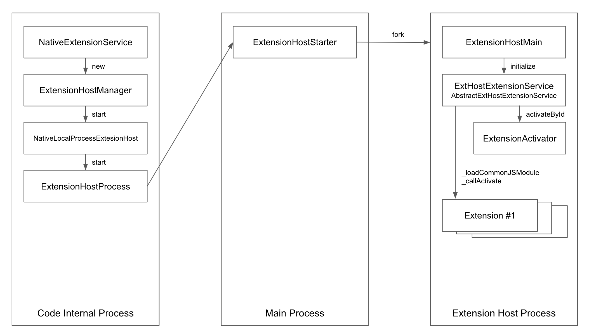

## VSCode Internal

##### 확장 프로그램(Extension) 편

`gamz`
\
\
\
\
\
\
\
_20230820 - First Created_

---
## 동기와 목적


<!--
- 갑자기 등장해 모든 에디터를 압도하기 시작하는 특별한 녀석 (기능/품질/완성도에 대한 얘기라기 보단)
- 내가 먹고 살게 해주는 위대한 소프트웨어, 심지어 오픈소스
-->

---
## 동기와 목적

- 그냥 알고 싶었다.
- 단순해보이지만 무한히 확장될 수 있는 소프트웨어를 지탱하는 아키텍쳐는 무엇일까 궁금했다.
- 특히, 이 모든걸 가능하게 해주는 핵심 기능인 **익스텐션 시스템**이 어떻게 동작하는지 궁금했다.
- 이런 동작원리를 엿보고 아키텍쳐적인 통찰을 학습하는게 목적이다.

---
## 학습 계획

- 실행 환경 셋업 / 코드 구조 파악
- 코드 트레이싱 (예: 검색)
- 익스텐션 제작 및 배포
- 익스텐션 로드 및 실행 흐름 분석
- 익스텐션 아키텍쳐
- 부록 - 그 외 흥미로운 것들

---
## 실행 환경 셋업

#### 1. 리파지토리 (https://github.com/microsoft/vscode) 클론
```sh
$ git clone https://github.com/microsoft/vscode.git
```

---
## 실행 환경 셋업

#### 2. 패키지 설치 및 빌드
```sh
$ cd vscode

# 패키지 설치
$ ./scripts/npm.sh

# 빌드
$ ./scripts/npm.sh compile

# 빌드 (파일 변경 감지)
$ ./scripts/npm.sh watch
```

---
## 실행 환경 셋업

#### 3. 앱(code) 실행
```sh
$ ./scripts/code.sh
```

---
## 실행 환경 셋업

#### 4. VSCode로 디버깅 환경


---
## 실행 환경 셋업

#### 4. VSCode로 디버깅 환경


---
## 코드 구조 파악
[Source Code Organization (Wiki)](https://github.com/microsoft/vscode-wiki/blob/main/Source-Code-Organization.md)

---
## 코드 구조 파악 (최상위 컴포넌트)


---
## 코드 구조 파악 (최상위 컴포넌트)

`base`

공통적으로 사용할 유틸리티들과 UI 빌딩 블럭들을 제공하며, 이들은 다른 레이어에서 사용(참조)됨
\
`platform`

서비스 주입(injection) 관련 지원과 `workbench` 및 `code` 같은 레이어에서 공유되는 기반 서비스들을 정의하고 있음. `editor` 또는 `workbench` 관련 서비스 및 코드들을 포함하면 안됨
\
`editor`

별도로 다운로드가 가능한 에디터인 _"Monaco"_ 라고 알려져있는 컴포넌트

---
## 코드 구조 파악 (최상위 컴포넌트)

`workbench`

다양한 에디터(_Monaco_, notebooks, custom editor)들을 호스트하면서 여러 패널(Explorer, Status Bar, Menu Bar, ...)을 위한 프레임워크를 제공. 또한, 이 레이어에서는 _Electron_ 을 이용하여 VS Code 데스크탑 버전을 구현하며 브라우저 API를 이용하여 VS Code 웹버전도 제공하고 있음
\
`code`

데스크탑 어플리케이션의 진입점(entrypoint)
\
`server`

원격 개발(Github codespaces, vcode.dev)을 위한 VS Code 서버 어플리케이션의 진입점

---
## 코드 구조 파악 (최상위 컴포넌트)


---
## 코드 구조 파악 (타겟 환경)


---
## 코드 구조 파악 (타겟 환경)

`common`

기본적인 JavaScript API 만을 필요로 해서 다른 모든 환경에서 실행될 수 있는 소스코드
\
`browser`

Browser API 를 필요로 하는 소스코드 배치 (`common`의 코드 참조 가능)
\
`node`
Node.JS API 를 필요로 하는 소스코드 배치 (`common`의 코드 참조 가능)

---
## 코드 구조 파악 (타겟 환경)

`electron-sandbox`

DOM 접근과 같은 Browser API 와 _Electron_ 메인 프로세스와 통신하기 위해 필요한 몇가지 API 를 필요로 하는 소스코드들을 배치 (`common`, `browser`, `electron-sandbox`의 코드 참조 가능)
\
`electron-main`

_Electron_ 메인 프로세스 API 를 필요로 하는 소스코드들 배치 (`common`, `node`의 코드 참조 가능)


---
## 코드 구조 파악 (타겟 환경)


---
## 코드 구조 파악

그 외 디테일들

- `editor` 및 `workbench` 소스 구조 / 컨벤션
- VS Code 데스크탑과 웹버전 분리에 따른 구조

---
## 코드 트레이싱

유스케이스 - 로컬 검색


---
코드 위치 파악을 위해 요소 검출 (ex: `find-widget`)


---
`@src/vs/editor/contrib/find/browser/*`


---
```ts
// @src/vs/editor/contrib/find/browser/findController.ts
export class NextMatchFindAction extends MatchFindAction {

  constructor() {
    super({
      id: FIND_IDS.NextMatchFindAction,
      label: nls.localize('findNextMatchAction', "Find Next"),
      alias: 'Find Next',
      precondition: undefined,
      kbOpts: [{
        kbExpr: EditorContextKeys.focus,
        primary: KeyCode.F3,
        mac: { primary: KeyMod.CtrlCmd | KeyCode.KeyG, secondary: [KeyCode.F3] },
        weight: KeybindingWeight.EditorContrib
      }, {
        kbExpr: ContextKeyExpr.and(EditorContextKeys.focus, CONTEXT_FIND_INPUT_FOCUSED),
        primary: KeyCode.Enter,
        weight: KeybindingWeight.EditorContrib
      }]
    });
  }

  protected _run(controller: CommonFindController): boolean {
>>  const result = controller.moveToNextMatch();
    if (result) {
      controller.editor.pushUndoStop();
      return true;
    }

    return false;
  }
}
```

---
```ts
// @src/vs/editor/contrib/find/browser/findController.ts
export class CommonFindController extends Disposable implements IEditorContribution {

	public static readonly ID = 'editor.contrib.findController';
  ...

  public moveToNextMatch(): boolean {
    if (this._model) {
>>    this._model.moveToNextMatch();
      return true;
    }
    return false;
  }

  ...
}
```

---
```ts
// @src/vs/editor/contrib/find/browser/findModel.ts
export class FindModelBoundToEditorModel {

  private readonly _editor: IActiveCodeEditor;
  private readonly _state: FindReplaceState;
  private readonly _decorations: FindDecorations;
  ...

  constructor(editor: IActiveCodeEditor, state: FindReplaceState) {
    this._editor = editor;
    ...
  }

  ...

  public moveToNextMatch(): void {
>>  this._moveToNextMatch(this._editor.getSelection().getEndPosition());
  }

  ...
}
```

---
```ts
// @src/vs/editor/contrib/find/browser/findModel.ts
export class FindModelBoundToEditorModel {
  ...

  private _moveToNextMatch(after: Position): void {
    if (!this._state.canNavigateForward()) {
      const prevMatchRange = this._decorations.matchBeforePosition(after);

      if (prevMatchRange) {
        this._setCurrentFindMatch(prevMatchRange);
      }
      return;
    }

    if (this._decorations.getCount() < MATCHES_LIMIT) {
      let nextMatchRange = this._decorations.matchAfterPosition(after);
      if (nextMatchRange && nextMatchRange.isEmpty() && nextMatchRange.getStartPosition().equals(after)) {
        after = this._nextSearchPosition(after);
        nextMatchRange = this._decorations.matchAfterPosition(after);
      }
      if (nextMatchRange) {
>>      this._setCurrentFindMatch(nextMatchRange);
      }
      return;
    }

    const nextMatch = this._getNextMatch(after, false, true);
    if (nextMatch) {
      this._setCurrentFindMatch(nextMatch.range);
    }
  }

  ...
}
```

---
```ts
// @src/vs/editor/contrib/find/browser/findModel.ts
export class FindModelBoundToEditorModel {
  ...

  private _setCurrentFindMatch(match: Range): void {
    const matchesPosition = this._decorations.setCurrentFindMatch(match);
    this._state.changeMatchInfo(
      matchesPosition,
      this._decorations.getCount(),
      match
    );

    this._editor.setSelection(match);
    this._editor.revealRangeInCenterIfOutsideViewport(match, ScrollType.Smooth);
  }

  ...
}
```

---
`NextMatchFindAction` 은 어떻게 호출된걸까? (액션 등록)

```ts
// @src/vs/editor/contrib/find/browser/findController.ts
registerEditorAction(NextMatchFindAction);
```

```ts
// @src/vs/editor/browser/editorExtensions.ts
export function registerEditorAction<T extends EditorAction>(ctor: { new(): T }): T {
  const action = new ctor();
>>EditorContributionRegistry.INSTANCE.registerEditorAction(action);
  return action;
}

class EditorContributionRegistry {
  public registerEditorAction(action: EditorAction) {
>>  action.register();
    this.editorActions.push(action);
  }
  ...
}
```

---
키바인딩 룰 및 커맨드 등록

```ts
// @src/vs/editor/browser/editorExtensions.ts
export abstract class Command {

  public register(): void {
    ...
    for (const kbOpts of kbOptsArr) {
      ...
      const desc = {
        id: this.id,
        weight: kbOpts.weight,
        args: kbOpts.args,
        when: kbWhen,
        primary: kbOpts.primary,
        secondary: kbOpts.secondary,
        ...
      };

>>    KeybindingsRegistry.registerKeybindingRule(desc);
    }

>>  CommandsRegistry.registerCommand({
      id: this.id,
      handler: (accessor, args) => this.runCommand(accessor, args),
      description: this._description
    });
  }
}
```

---
검색창에서 검색어 입력하고 Enter 입력하면?

```ts
// @src/vs/workbench/services/keybinding/browser/keybindingService.ts
export class WorkbenchKeybindingService extends AbstractKeybindingService {
  ...
  constructor(...) {
    ...
    this._register(dom.addDisposableListener(window, dom.EventType.KEY_DOWN,
      (e: KeyboardEvent) => {
        this.isComposingGlobalContextKey.set(e.isComposing);
        const keyEvent = new StandardKeyboardEvent(e);
>>      const shouldPreventDefault = this._dispatch(keyEvent, keyEvent.target);
        if (shouldPreventDefault) {
          keyEvent.preventDefault();
        }
        this.isComposingGlobalContextKey.set(false);
      }
    ));
    ...
}
```

---
```ts
// @src/vs/platform/keybinding/common/abstractKeybindingService.ts
export abstract class AbstractKeybindingService extends Disposable implements IKeybindingService {
  ...
  protected _dispatch(e: IKeyboardEvent, target: IContextKeyServiceTarget): boolean {
>>  return this._doDispatch(this.resolveKeyboardEvent(e), target, false);
  }
  ...

  private _doDispatch(
    userKeypress: ResolvedKeybinding,
    target: IContextKeyServiceTarget,
    isSingleModiferChord = false
  ): boolean {

    let userPressedChord: string | null = null;
    let currentChords: string[] | null = null;
    ...

    const contextValue = this._contextKeyService.getContext(target);
    const keypressLabel = userKeypress.getLabel();

>>  const resolveResult = this._getResolver().resolve(contextValue, currentChords, userPressedChord);
    ...
  }
  ...
}
```

---
```ts
// @src/vs/platform/keybinding/common/keybindingResolver.ts
export class KeybindingResolver {
  ...

  public resolve(context: IContext, currentChords: string[], keypress: string): ResolutionResult {
    ...
    let lookupMap: ResolvedKeybindingItem[] | null = null;
    ...
>>  const result = this._findCommand(context, lookupMap);
    ...
    return KbFound(result.command, result.commandArgs, result.bubble);
  }

  private _findCommand(context: IContext, matches: ResolvedKeybindingItem[]): ResolvedKeybindingItem | null {
    for (let i = matches.length - 1; i >= 0; i--) {
      const k = matches[i];
      if (!KeybindingResolver._contextMatchesRules(context, k.when)) {
        continue;
      }
>>    return k;
    }
    return null;
  }
  ...
}
```

---
```ts
// @src/vs/platform/keybinding/common/abstractKeybindingService.ts
export abstract class AbstractKeybindingService extends Disposable implements IKeybindingService {
  ...
  private _doDispatch(userKeypress: ResolvedKeybinding, ...): boolean {
    ...
    const resolveResult = this._getResolver().resolve(contextValue, currentChords, userPressedChord);

    switch (resolveResult.kind) {
      ...
      case ResultKind.KbFound: {
        if (resolveResult.commandId === null || resolveResult.commandId === '') {
          ...
        } else {
          ...
>>        this._commandService.executeCommand(resolveResult.commandId)
            .then(undefined, err => this._notificationService.warn(err));
        }

        return shouldPreventDefault;
      }
    }
    ...
  }
  ...
}
```

---
```ts
// @src/vs/workbench/services/commands/common/commandService.ts
export class CommandService extends Disposable implements ICommandService {
  ...

  async executeCommand<T>(id: string, ...args: any[]): Promise<T> {
    this._logService.trace('CommandService#executeCommand', id);

    const activationEvent = `onCommand:${id}`;
    const commandIsRegistered = !!CommandsRegistry.getCommand(id);

    if (commandIsRegistered) {

      // if the activation event has already resolved (i.e. subsequent call),
      // we will execute the registered command immediately
      if (this._extensionService.activationEventIsDone(activationEvent)) {
>>      return this._tryExecuteCommand(id, args);
      }
      ...
    }
    ...
  }
}
```

---
```ts
// @src/vs/workbench/services/commands/common/commandService.ts
export class CommandService extends Disposable implements ICommandService {
  ...

  private _tryExecuteCommand(id: string, args: any[]): Promise<any> {
    const command = CommandsRegistry.getCommand(id);
    if (!command) {
      return Promise.reject(new Error(`command '${id}' not found`));
    }
    try {
      this._onWillExecuteCommand.fire({ commandId: id, args });
>>    const result = this._instantiationService.invokeFunction(command.handler, ...args);
      this._onDidExecuteCommand.fire({ commandId: id, args });
      return Promise.resolve(result);
    } catch (err) {
      return Promise.reject(err);
    }
  }
}
```

---
```ts
// @src/vs/editor/browser/editorExtensions.ts
export abstract class Command {
  ...

  public register(): void {
    ...

    CommandsRegistry.registerCommand({
      id: this.id,
>>    handler: (accessor, args) => this.runCommand(accessor, args),
      description: this._description
    });
  }
```

---
```ts
// @src/vs/editor/browser/editorExtensions.ts
export abstract class EditorCommand extends Command {
  ...

  public runCommand(accessor: ServicesAccessor, args: any): void | Promise<void> {
>>  return EditorCommand.runEditorCommand(accessor, args, this.precondition,
      (accessor, editor, args) => this.runEditorCommand(accessor, editor, args));
  }

  public static runEditorCommand(
    accessor: ServicesAccessor,
    args: any,
    precondition: ContextKeyExpression | undefined,
    runner: (accessor: ServicesAccessor | null, editor: ICodeEditor, args: any) => void | Promise<void>
  ): void | Promise<void> {
    // Find the editor with text focus or active
    const editor = ...

    return editor.invokeWithinContext((editorAccessor) => {
      ...
>>    return runner(editorAccessor, editor, args);
    });
  }

  public runCommand(accessor: ServicesAccessor, args: any): void | Promise<void> {
>>  return EditorCommand.runEditorCommand(accessor, args, this.precondition,
      (accessor, editor, args) => this.runEditorCommand(accessor, editor, args));
  }
}
```

---
```ts
// @src/vs/editor/browser/editorExtensions.ts
export abstract class EditorAction extends EditorCommand {
  ...
  public runEditorCommand(
    accessor: ServicesAccessor,
    editor: ICodeEditor,
    args: any): void | Promise<void> {
    ...
>>  return this.run(accessor, editor, args || {});
  }
}
```

```ts
// @src/vs/editor/browser/editorExtensions.ts
export abstract class MatchFindAction extends EditorAction {
  public async run(accessor: ServicesAccessor | null, editor: ICodeEditor): Promise<void> {
    const controller = CommonFindController.get(editor);
>>  if (controller && !this._run(controller)) { ... }
  }
}
```

---
```ts
// @src/vs/editor/contrib/find/browser/findController.ts
export class NextMatchFindAction extends MatchFindAction {
  ...

  protected _run(controller: CommonFindController): boolean {
>>  const result = controller.moveToNextMatch();
    if (result) {
      controller.editor.pushUndoStop();
      return true;
    }

    return false;
  }
}
```

---
### 익스텐션 **제작** 및 배포

[Your First Extension](https://code.visualstudio.com/api/get-started/your-first-extension) 가이드 참고

```sh
$ npm install -g yo generator-code

$ yo code

# ? What type of extension do you want to create? New Extension (TypeScript)
# ? What's the name of your extension? HelloWorld
### Press <Enter> to choose default for all options below ###

# ? What's the identifier of your extension? helloworld
# ? What's the description of your extension? LEAVE BLANK
# ? Initialize a git repository? Yes
# ? Bundle the source code with webpack? No
# ? Which package manager to use? npm

# ? Do you want to open the new folder with Visual Studio Code? Open with `code`
```

---
### 익스텐션 **제작** 및 배포


---
### 익스텐션 **제작** 및 배포

다운로드 및 설치는 `QuiCLI` 검색


소스 코드는 https://github.com/sangwonl/vscode-extension-quicli 참고

---
### 익스텐션 **제작** 및 배포

```ts
import { ExtensionContext } from 'vscode';
import { ShellCommandExtracter } from './extracter';
import { CommandHandler, TextEditorLineGetter } from './handler';

export function activate(context: ExtensionContext) {
  new CommandHandler(
    context,
    new ShellCommandExtracter(new TextEditorLineGetter())
  );
}

// This method is called when your extension is deactivated
export function deactivate() {}
```

---
### 익스텐션 **제작** 및 배포

```ts
import { ExtensionContext, Terminal, commands, window } from 'vscode';

export class CommandHandler {
  ...
  constructor(
    private context: ExtensionContext,
    private commandExtracter: ICommandExtracter,
  ) {
    const handlerMap = {
      'quicli.runCommandInTerminal': this.onRunCommandInTerminal,
    };

    Object.entries(handlerMap).forEach(([command, handler]) => {
      const disposable = commands.registerCommand(command, handler);
      this.context.subscriptions.push(disposable);
    });
  }

  private onRunCommandInTerminal = (_args: any[]) => {
    const command = this.getCommandOnCursorLine();
    const term = this.getDedicatedTerminal();
    term.sendText(command, true);
    term.show(true);
  };
  ...
```

---
### 익스텐션 **제작** 및 배포
```ts
  ...
  private getCursorLineNumber = (): number | undefined => {
    const activeEditor = window.activeTextEditor;
    if (!activeEditor) {
      return undefined;
    }

    return activeEditor.selection.active.line;
  };

  private getDedicatedTerminal = (): Terminal => {
    if (this.terminal && !this.terminal.exitStatus) {
      return this.terminal;
    }

    const name = TERMINAL_NAME;
    this.terminal = window.terminals.find(t => t.name === name);
    if (!this.terminal) {
      this.terminal = window.createTerminal(name);
      this.context.subscriptions.push(this.terminal);
    }

    return this.terminal;
  };
}
```

---
### 익스텐션 제작 및 **배포**

```js
// @package.json
{
  "name": "quicli",
  "displayName": "QuiCLI",
  "description": "Run shell command on the fly",
  "version": "0.0.3",
  "repository": {
    "type": "git",
    "url": "https://github.com/sangwonl/vscode-extension-quicli.git"
  },
  "icon": "assets/icon.png",
  "publisher": "gamz",
  "categories": [
    "Other"
  ],
  "activationEvents": [
    "onStartupFinished"
  ],
  "contributes": {
    "commands": [
      {
        "command": "quicli.runCommandInTerminal",
        "category": "QuiCLI",
        "title": "Run Command in Terminal"
      }
    ]
  },
  ...
```

---
### 익스텐션 제작 및 **배포**

#### 1. Publisher 생성

#### 2. 수동으로 Extension 배포

#### 3. CLI 로 Extension 배포 (Organization 및 Person Access Token 생성)
\
\
\
[Publishing Extensions](https://code.visualstudio.com/api/working-with-extensions/publishing-extension#publishing-extensions) 가이드 참고

---
### 익스텐션 제작 및 **배포**

#### 1. Publisher 생성


---
### 익스텐션 제작 및 **배포**

#### 2. 수동으로 Extension 배포

```sh
$ npm install -g @vscode/vsce
$ vsce package
$ ls
quicli-0.0.4.vsix ...
```

---
### 익스텐션 제작 및 **배포**

#### 2. 수동으로 Extension 배포


---
### 익스텐션 제작 및 **배포**

#### 3. CLI 로 Extension 배포 (Organization 및 Person Access Token 생성)


---
### 익스텐션 제작 및 **배포**

#### 3. CLI 로 Extension 배포 (Organization 및 Person Access Token 생성)


---
### 익스텐션 제작 및 **배포**

#### 3. CLI 로 Extension 배포 (Organization 및 Person Access Token 생성)


---
### 익스텐션 제작 및 **배포**

```sh
$ npm install -g @vscode/vsce
$ vsce publish
 INFO  Publishing 'gamz.quicli v0.0.4'...
 INFO  Extension URL (might take a few minutes): https://marketplace.visualstudio.com/items?itemName=gamz.quicli
 INFO  Hub URL: https://marketplace.visualstudio.com/manage/publishers/gamz/extensions/quicli/hub
 DONE  Published gamz.quicli v0.0.4.
```


---
### 익스텐션 로드 및 실행 흐름 분석

VS Code 어플리케이션 시작 (internal process 부트스트래핑)

```ts
// @src/vs/workbench/electron-sandbox/desktop.main.ts
// running on code internal process
export function main(configuration: INativeWindowConfiguration): Promise<void> {
  const workbench = new DesktopMain(configuration);

  return workbench.open();
}

export class DesktopMain extends Disposable {
  ...
  async open(): Promise<void> {
    // Init services and wait for DOM to be ready in parallel
    const [services] = await Promise.all([this.initServices(), domContentLoaded()]);

    // Create Workbench
    const workbench = new Workbench(document.body, { extraClasses: this.getExtraClasses() }, services...);

    // Listeners
    this.registerListeners(workbench, services.storageService);

    // Startup
>>  const instantiationService = workbench.startup();

    // Window
    this._register(instantiationService.createInstance(NativeWindow));
  }
```

---
익스텐션 호스트 프로세스를 시작하는 흐름

```ts
// @src/vs/workbench/services/extensions/electron-sandbox/nativeExtensionService.ts
// running on code internal process
export class NativeExtensionService extends AbstractExtensionService implements IExtensionService {

  constructor(
    @IInstantiationService instantiationService: IInstantiationService,
    @ILifecycleService lifecycleService: ILifecycleService,
    ...
  ) {
    ...

    lifecycleService.when(LifecyclePhase.Ready).then(() => {
      // reschedule to ensure this runs after restoring viewlets, panels, and editors
      runWhenIdle(() => {
>>      this._initialize();
      }, 50 /*max delay*/);
    });
  }

  protected async _initialize(): Promise<void> {
>>  this._startExtensionHostsIfNecessary(true, []);
    ...
  }
  ...
}
```

---
```ts
// @src/vs/workbench/services/extensions/electron-sandbox/nativeExtensionService.ts
// running on code internal process
export class NativeExtensionService extends AbstractExtensionService implements IExtensionService {
  ...

  private _startExtensionHostsIfNecessary(isInitialStart: boolean, initialActivationEvents: string[]): void {
    ...
>>  const extHostManager = this._createExtensionHostManager(location, isInitialStart, initialActivationEvents);
    ...
  }

  private _createExtensionHostManager(
    runningLocation: ExtensionRunningLocation,
    isInitialStart: boolean,
    initialActivationEvents: string[]
  ): IExtensionHostManager | null {
    const extensionHost = this._extensionHostFactory.createExtensionHost(
      this._runningLocations,
      runningLocation,
      isInitialStart);
    ...

>>  const processManager: IExtensionHostManager = this._doCreateExtensionHostManager(extensionHost, initialActivationEvents);
    ...
  }

  protected _doCreateExtensionHostManager(extensionHost: IExtensionHost, initialActivationEvents: string[]): IExtensionHostManager {
>>  return createExtensionHostManager(
      this._instantiationService,
      extensionHost,
      initialActivationEvents,
      this._acquireInternalAPI(extensionHost));
  }
  ...
}
```

---
```ts
// @src/vs/workbench/services/extensions/common/extensionHostManager.ts
// running on code internal process
class ExtensionHostManager extends Disposable implements IExtensionHostManager {
  ...
  constructor(
    extensionHost: IExtensionHost,
    initialActivationEvents: string[],
    ...
  ) {
    ...

>>  this._proxy = this._extensionHost.start().then(
      (protocol) => {
        ...
        return this._createExtensionHostCustomers(this.kind, protocol);
      },
      ...
    );
    this._proxy.then(() => {
      initialActivationEvents.forEach((activationEvent) => this.activateByEvent(activationEvent, ActivationKind.Normal));
      ...
    });
  }

```

---
```ts
// @src/vs/workbench/services/extensions/electron-sandbox/localProcessExtensionHost.ts
// running on code internal process
export class NativeLocalProcessExtensionHost implements IExtensionHost {
  ...
  public start(): Promise<IMessagePassingProtocol> {
    ...
    if (!this._messageProtocol) {
>>    this._messageProtocol = this._start();
    }
    ...
  }

  protected async _start(): Promise<IMessagePassingProtocol> {
    ...
>>  return this._startWithCommunication(communication);
  }

  protected async _startWithCommunication<T>(communication: IExtHostCommunication<T>): Promise<IMessagePassingProtocol> {
    const [extensionHostCreationResult, communicationPreparedData, portNumber, processEnv] = await Promise.all([
>>    this._extensionHostStarter.createExtensionHost(),
      communication.prepare(),
      this._tryFindDebugPort(),
      this._shellEnvironmentService.getShellEnv(),
    ]);

    this._extensionHostProcess = new ExtensionHostProcess(extensionHostCreationResult.id, this._extensionHostStarter);
    ...

    // Initialize extension host process with hand shakes
>>  const protocol = await communication.establishProtocol(communicationPreparedData, this._extensionHostProcess, opts);
    ...
  }
  ...
}
```

---
```ts
// @src/vs/workbench/services/extensions/electron-sandbox/localProcessExtensionHost.ts
// running on code internal process
export class ExtHostMessagePortCommunication extends Disposable implements IExtHostCommunication<void> {
  ...

  establishProtocol(prepared: void, extensionHostProcess: ExtensionHostProcess, opts: IExtensionHostProcessOptions): Promise<IMessagePassingProtocol> {
    ...
    return new Promise<IMessagePassingProtocol>((resolve, reject) => {
      ...
      // 익스텐션 호스트 프로세스 시작
      // 내부적으로 현재 프로세스에서 main 프로세스로 IPC 후에
      // main 프로세스에서 익스텐션 호스트 프로세스를 fork
>>    extensionHostProcess.start(opts).then(() => { ... });
      ...
    })
    ...
  }
  ...
}

// @src/vs/workbench/services/extensions/electron-sandbox/localProcessExtensionHost.ts
// running on code internal process
export class ExtensionHostProcess {
  ...

  constructor(
    id: string,
    private readonly _extensionHostStarter: IExtensionHostStarter,
  ) {
    this._id = id;
  }

  public start(opts: IExtensionHostProcessOptions): Promise<void> {
    // main 프로세스로 IPC
>>  return this._extensionHostStarter.start(this._id, opts);
  }
  ...
}
```

---
한편, main 프로세스의 부트스트래핑
```ts
// @src/vs/code/electron-main/main.ts
// running on main process
class CodeMain {
  main(): void {
    try {
>>    this.startup();
    }
    ...
  }

  private async startup(): Promise<void> {
    ...
    const [
      instantiationService,
      instanceEnvironment,
      environmentMainService,
      configurationService,
      stateMainService,
      productService,
      userDataProfilesMainService] = this.createServices();

    await this.initServices(
      environmentMainService,
      userDataProfilesMainService,
      configurationService,
      stateMainService,
      productService);
    ...
    await instantiationService.invokeFunction(async accessor => {
      ...
>>    return instantiationService.createInstance(CodeApplication,
       mainProcessNodeIpcServer, instanceEnvironment).startup();
    }
   ...
  }
  ...
}
```

---
```ts
// @src/vs/code/electron-main/app.ts
// running on main process
export class CodeApplication extends Disposable {
  async startup(): Promise<void> {
    // Main process server (electron IPC based)
    const mainProcessElectronServer = new ElectronIPCServer();
    ...

    // Shared process
    const { sharedProcessClient } = this.setupSharedProcess(machineId);
    ...

    appInstantiationService.invokeFunction(accessor =>
>>    this.initChannels(accessor, mainProcessElectronServer, sharedProcessClient));

    ...
  }

  private initChannels(
    accessor: ServicesAccessor,
    mainProcessElectronServer: ElectronIPCServer,
    sharedProcessClient: Promise<MessagePortClient>
  ): void {
    // Extension Host Starter
>>  const extensionHostStarterChannel = ProxyChannel.fromService(
      accessor.get(IExtensionHostStarter));

    mainProcessElectronServer.registerChannel(
      ipcExtensionHostStarterChannelName,
      extensionHostStarterChannel);
      ...
  }
  ...
}
```

---
```ts
// @src/vs/platform/extensions/electron-main/extensionHostStarter.ts
// running on main process
export class ExtensionHostStarter implements IDisposable, IExtensionHostStarter {
  private _getExtHost(id: string): WindowUtilityProcess {
    return this._extHosts.get(id);
  }

  async createExtensionHost(): Promise<{ id: string }> {
    ...
    const extHost = new WindowUtilityProcess(this._windowsMainService, this._lifecycleMainService, ...);
    this._extHosts.set(id, extHost);
    ...
    return { id };
  }

  async start(id: string, opts: IExtensionHostProcessOptions): Promise<void> {
    ...
    // 익스텐션 호스트 프로세스 fork
>>  this._getExtHost(id).start({
      ...opts,
      type: 'extensionHost',
      entryPoint: 'vs/workbench/api/node/extensionHostProcess',
      args: ['--skipWorkspaceStorageLock'],
      execArgv: opts.execArgv,
      allowLoadingUnsignedLibraries: true,
      forceAllocationsToV8Sandbox: true,
      correlationId: id
    });
  }
  ...
}
```

---
```ts
// @src/vs/workbench/api/node/extensionHostProcess.ts
// running on extention host process
async function startExtensionHostProcess(): Promise<void> {
  ...
  const protocol = await createExtHostProtocol();
  const renderer = await connectToRenderer(protocol);
  const { initData } = renderer;
  ...

  const hostUtils = new class NodeHost implements IHostUtils {
    exit(code: number) { nativeExit(code); }
    fsExists(path: string) { return Promises.exists(path); }
    fsRealpath(path: string) { return realpath(path); }
  };

  let uriTransformer: IURITransformer | null = null;
  if (initData.remote.authority && args.transformURIs) {
    uriTransformer = createURITransformer(initData.remote.authority);
  }

  ...
  const extensionHostMain = new ExtensionHostMain(
    renderer.protocol,
    initData,
    hostUtils,
    uriTransformer
  );
  ...
}

startExtensionHostProcess().catch((err) => console.log(err));
```

---
### 익스텐션 로드 및 실행 흐름 분석

익스텐션 로드 및 초기화 (`activate`)

```ts
// @src/vs/workbench/api/common/extensionHostMain.ts
// running on extention host process
export class ExtensionHostMain {
  ...
  constructor(...) {
    ...

    // bootstrap services
    const services = new ServiceCollection(...getSingletonServiceDescriptors());
    services.set(IExtHostInitDataService, { _serviceBrand: undefined, ...initData, messagePorts });
    services.set(IExtHostRpcService, new ExtHostRpcService(this._rpcProtocol));
    services.set(IURITransformerService, new URITransformerService(uriTransformer));
    services.set(IHostUtils, hostUtils);
    ...

    const instaService: IInstantiationService = new InstantiationService(services, true);
    ...

    this._extensionService = instaService.invokeFunction(accessor => accessor.get(IExtHostExtensionService));
>>  this._extensionService.initialize();
    ...
  }
  ...
}
```

---
```ts
// @src/vs/workbench/api/common/extHostExtensionService.ts
// running on extention host process
export abstract class AbstractExtHostExtensionService extends Disposable
  implements ExtHostExtensionServiceShape {
  ...

  public async initialize(): Promise<void> {
    ...
    if (this._initData.autoStart) {
>>    this._startExtensionHost();
    }
    ...
  }

  private _startExtensionHost(): Promise<void> {
    this._started = true;

    return this._readyToStartExtensionHost.wait()
      .then(() => this._readyToRunExtensions.open())
      .then(() => {
        // wait for all activation events that came in during workbench startup, but at maximum 1s
        return Promise.race([this._activator.waitForActivatingExtensions(), timeout(1000)]);
      })
>>    .then(() => this._handleEagerExtensions())
      .then(() => {
        this._eagerExtensionsActivated.open();
      });
  }
  ...
}
```

---
```ts
// @src/vs/workbench/api/common/extHostExtensionService.ts
// running on extention host process
export abstract class AbstractExtHostExtensionService extends Disposable implements ExtHostExtensionServiceShape {
  private _handleEagerExtensions(): Promise<void> {
    ...
    const eagerExtensionsActivation = Promise.all([
      remoteResolverActivation,
      starActivation,
      workspaceContainsActivation]).then(() => { });

    Promise.race([eagerExtensionsActivation, timeout(10000)]).then(() => {
>>    this._activateAllStartupFinished();
    });
    return eagerExtensionsActivation;
  }

  private _activateAllStartupFinished(): void {
    ...
    this._extHostConfiguration.getConfigProvider().then((configProvider) => {
      const allExtensionDescriptions = this._myRegistry.getAllExtensionDescriptions();
      if (!shouldDeferActivation) {
        for (const desc of allExtensionDescriptions) {
          if (desc.activationEvents) {
            for (const activationEvent of desc.activationEvents) {
              if (activationEvent === 'onStartupFinished') {
>>              this._activateOneStartupFinished(desc, activationEvent);
              }
            }
          }
        }
      }
    });
  }
  ...
}
```

---
```ts
// @src/vs/workbench/api/common/extHostExtensionService.ts
// running on extention host process
export abstract class AbstractExtHostExtensionService extends Disposable
  implements ExtHostExtensionServiceShape {
  ...

  private _activateOneStartupFinished(
    desc: IExtensionDescription,
    activationEvent: string
  ): void {
>>  this._activateById(desc.identifier, {
      startup: false,
      extensionId: desc.identifier,
      activationEvent: activationEvent
    }).then(undefined, (err) => {
      this._logService.error(err);
    });
  }

  private _activateById(
    extensionId: ExtensionIdentifier,
    reason: ExtensionActivationReason
  ): Promise<void> {
>>  return this._activator.activateById(extensionId, reason);
  }
  ...
}
```

---
```ts
// @src/vs/workbench/api/common/extHostExtensionActivator.ts
// running on extention host process
export class ExtensionsActivator implements IDisposable {
  private readonly _registry: ExtensionDescriptionRegistry;
  private readonly _operations: ExtensionIdentifierMap<ActivationOperation>
  ...

  public isActivated(extensionId: ExtensionIdentifier): boolean {
    const op = this._operations.get(extensionId);
    return Boolean(op && op.value);
  }

  public activateById(
    extensionId: ExtensionIdentifier,
    reason: ExtensionActivationReason
  ): Promise<void> {
    const desc = this._registry.getExtensionDescription(extensionId);
    ...
>>  return this._activateExtensions([{ id: desc.identifier, reason }]);
  }

  private async _activateExtensions(extensions: ActivationIdAndReason[]): Promise<void> {
    const operations = extensions
      .filter((p) => !this.isActivated(p.id))
 >>   .map(ext => this._handleActivationRequest(ext));
    await Promise.all(operations.map(op => op.wait()));
  }

  ...
}
```

---
```ts
// @src/vs/workbench/api/common/extHostExtensionActivator.ts
// running on extention host process
export class ExtensionsActivator implements IDisposable {
  private _handleActivationRequest(currentActivation: ActivationIdAndReason): ActivationOperation {
    const currentExtension = this._registry.getExtensionDescription(currentActivation.id);
    ...

    const deps: ActivationOperation[] = [];
    const depIds = currentExtension.extensionDependencies;
		for (const depId of depIds) { ... }
    ...

>>  return this._createAndSaveOperation(
      currentActivation, currentExtension.displayName, deps, null);
  }

  private _createAndSaveOperation(
    activation: ActivationIdAndReason,
    displayName: string | null | undefined,
    deps: ActivationOperation[],
    value: ActivatedExtension | null
  ): ActivationOperation {
>>  const operation = new ActivationOperation(
      activation.id, displayName, activation.reason, deps, value, ...);
    this._operations.set(activation.id, operation);
    return operation;
  }
  ...
}
```

---
```ts
// @src/vs/workbench/api/common/extHostExtensionActivator.ts
// running on extention host process
class ActivationOperation {
  ...
  constructor(
    private _value: ActivatedExtension | null,
    private readonly _host: IExtensionsActivatorHost,
    ...
  ) {
>>  this._initialize();
  }
  ...

  private async _initialize(): Promise<void> {
>>  await this._waitForDepsThenActivate();
    ...
  }

  private async _waitForDepsThenActivate(): Promise<void> {
    ...
>>  await this._activate();
  }

  private async _activate(): Promise<void> {
    ...
>>   this._value = await this._host.actualActivateExtension(this._id, this._reason);
  }
}
```

---
```ts
// @src/vs/workbench/api/common/extHostExtensionService.ts
// running on extention host process
export abstract class AbstractExtHostExtensionService extends Disposable
  implements ExtHostExtensionServiceShape {
  ...
  constructor(...) {
    this._globalRegistry = new ExtensionDescriptionRegistry(...);
    this._myRegistry = new ExtensionDescriptionRegistry(...);
    ...

    this._activator = this._register(new ExtensionsActivator(
      this._myRegistry,
      this._globalRegistry,
      {
        actualActivateExtension: async (
          extensionId: ExtensionIdentifier,
          reason: ExtensionActivationReason): Promise<ActivatedExtension> => {
          if (ExtensionDescriptionRegistry.isHostExtension(extensionId, ...)) {
            await this._mainThreadExtensionsProxy.$activateExtension(extensionId, reason);
            return new HostExtension();
          }
          const extensionDescription = this._myRegistry.getExtensionDescription(extensionId)!;
>>        return this._activateExtension(extensionDescription, reason);
        },
        ...
      },
      ...
    ));
    ...
  }
  ...
}
```

---
```ts
// @src/vs/workbench/api/common/extHostExtensionService.ts
// running on extention host process
export abstract class AbstractExtHostExtensionService extends Disposable
  implements ExtHostExtensionServiceShape {
  ...
  private async _activateExtension(
    extensionDescription: IExtensionDescription,
    reason: ExtensionActivationReason
  ): Promise<ActivatedExtension> {
    ...
>>  return this._doActivateExtension(extensionDescription, reason).then(...);
  }

  private _doActivateExtension(
    extensionDescription: IExtensionDescription,
    reason: ExtensionActivationReason
  ): Promise<ActivatedExtension> {
    ...
    return Promise.all([
>>    this._loadCommonJSModule<IExtensionModule>(
        extensionDescription, joinPath(extensionDescription.extensionLocation, entryPoint), ...),
      this._loadExtensionContext(extensionDescription)
    ]).then(values => {
>>    return AbstractExtHostExtensionService._callActivate(
        extensionDescription.identifier, values[0], values[1], ...);
    }).then((activatedExtension) => {
      return activatedExtension;
    });
  }
  ...
}
```

---
```ts
// @src/vs/workbench/api/node/extHostExtensionService.ts
// running on extention host process
export class ExtHostExtensionService extends AbstractExtHostExtensionService {
  ...
  protected async _loadCommonJSModule<T>(
    extension: IExtensionDescription | null, module: URI, ...): Promise<T> {
    ...
    let r: T | null = null;
    ...
>>  r = require.__$__nodeRequire<T>(module.fsPath);
    ...
    return r;
  }

  private static _callActivate(
    extensionId: ExtensionIdentifier,
    extensionModule: IExtensionModule,
    context: vscode.ExtensionContext,
    ...
  ): Promise<ActivatedExtension> {
    ...
>>  return this._callActivateOptional(extensionId, extensionModule, context, ...).then((extensionExports) => {
      return new ActivatedExtension(...);
    });
  }

  private static _callActivateOptional(
    extensionId: ExtensionIdentifier,
    extensionModule: IExtensionModule,
    context: vscode.ExtensionContext,
    ...
  ): Promise<IExtensionAPI> {
    ...
>>  const activateResult: Promise<IExtensionAPI> = extensionModule.activate.apply(scope, [context]);
    ...
    }
  }
```

---
```js
// @~/.vscode-oss-dev/extensions/gamz.quicli-0.0.4/out/extension.js
// running on extention host process
"use strict";
Object.defineProperty(exports, "__esModule", { value: true });
exports.deactivate = exports.activate = void 0;
const extracter_1 = require("./extracter");
const handler_1 = require("./handler");
function activate(context) {
>>  const cmdExtracter = new extracter_1.ShellCommandExtracter(new handler_1.TextEditorLineGetter());
    new handler_1.CommandHandler(context, cmdExtracter);
}
exports.activate = activate;
// This method is called when your extension is deactivated
function deactivate() { }
exports.deactivate = deactivate;
//# sourceMappingURL=extension.js.map
```

---
### 익스텐션 로드 및 실행 흐름 분석

커맨드 실행 (Command Palette 로부터)

```ts
// @src/vs/platform/quickinput/browser/commandsQuickAccess.ts
// running on code internal process
export abstract class AbstractCommandsQuickAccessProvider extends PickerQuickAccessProvider<ICommandQuickPick>
  implements IDisposable {
  ...

  constructor(
    @ICommandService private readonly commandService: ICommandService,
    ...
  ) { ... }

  private toCommandPick(
    commandPick: ICommandQuickPick | IQuickPickSeparator,
    runOptions?: IQuickAccessProviderRunOptions): ICommandQuickPick | IQuickPickSeparator {
    ...

    return {
      ...commandPick,
      accept: async () => {
        ...
>>      await this.commandService.executeCommand(commandPick.commandId, ...commandPick.args)
        ...
      }
      },
      ...
    };
  }
```

---
```ts
// @src/vs/workbench/services/commands/common/commandService.ts
// running on code internal process
export class CommandService extends Disposable implements ICommandService {
  ...
  async executeCommand<T>(id: string, ...args: any[]): Promise<T> {
    ...
    const activationEvent = `onCommand:${id}`;
    const commandIsRegistered = !!CommandsRegistry.getCommand(id);
    if (commandIsRegistered) {
      ...
      await this._extensionService.activateByEvent(activationEvent);
>>    return this._tryExecuteCommand(id, args);
    }
    ...
  }

  private _tryExecuteCommand(id: string, args: any[]): Promise<any> {
    const command = CommandsRegistry.getCommand(id);
    this._onWillExecuteCommand.fire({ commandId: id, args });
>>  const result = this._instantiationService.invokeFunction(command.handler, ...args);
    this._onDidExecuteCommand.fire({ commandId: id, args });
    ...
  }
```

---
```ts
// @src/vs/workbench/api/browser/mainThreadCommands.ts
// running on code internal process
@extHostNamedCustomer(MainContext.MainThreadCommands)
export class MainThreadCommands implements MainThreadCommandsShape {
  ...
  $registerCommand(id: string): void {
    this._commandRegistrations.set(id,
      CommandsRegistry.registerCommand(id, (accessor, ...args) => {
>>      return this._proxy.$executeContributedCommand(id, ...args).then(...);
      })
    );
    ...
  }
}


// @src/vs/workbench/api/common/extHostCommands.ts
// running on extention host process (여기서 프로세스 전환)
export class ExtHostCommands implements ExtHostCommandsShape {
  ...
  $executeContributedCommand(id: string, ...args: any[]): Promise<unknown> {
    const cmdHandler = this._commands.get(id);
    ...
>>  return this._executeContributedCommand(id, args, true);
  }
  ...
}
```

---
```ts
// @src/vs/workbench/api/common/extHostCommands.ts
// running on extention host process
export class ExtHostCommands implements ExtHostCommandsShape {
  ...

  private async _executeContributedCommand<T = unknown>(
    id: string,
    args: any[],
    annotateError: boolean
  ): Promise<T> {
    const command = this._commands.get(id);
    ...
>>  return await callback.apply(thisArg, args);
  }
  ...
}

// @~/.vscode-oss-dev/extensions/gamz.quicli-0.0.4/out/extension.js
// running on extention host process
"use strict";
Object.defineProperty(exports, "__esModule", { value: true });
exports.TextEditorLineGetter = exports.CommandHandler = void 0;
const vscode_1 = require("vscode");
class CommandHandler {
  constructor(context, commandExtracter) {
    ...
>>  this.onRunCommandInTerminal = (_args) => { ... }
  }
}
```

---
### 익스텐션 로드 및 실행 흐름 분석

요약 - 익스텐션 로드 & 활성화



---
### 익스텐션 로드 및 실행 흐름 분석

요약 - 익스텐션 커맨드 실행


---
### 익스텐션 아키텍쳐
\
익스텐션 호스트 종류

`local` UI 와 동일한 머신에서 로컬로 돌아가는 Node.js 기반의 익스텐션 호스트
`web` UI 와 동일한 머신 브라우저에서 돌아가는 웹 기반의 익스텐션 호스트
`remote` 컨테이너 처럼 원격으로 돌아가는 Node.js 기반의 익스텐션 호스트
\
\
익스텐션 호스트 런타임

`Node.js` 로컬(`local`)과 원격(`remote`) 익스텐션 호스트의 런타임
`Browser` 웹(`web`) 익스텐션 호스트의 런타임, 브라우저 WebWorker를 사용

---
### 익스텐션 아키텍쳐
\


---
### 익스텐션 아키텍쳐
\
Preferred location(runtime): `extensionKind`

`workspace` 원격에서 실행되길 선호하는 익스텐션
`ui` 로컬(UI와 같은 머신)에서 실행되길 선호하는 익스텐션
```json
{
  "name": "wordcount",
  "displayName": "Word Count",
  "version": "0.1.0",
  "publisher": "ms-vscode",
  "extensionKind": ["ui", "workspace"],
  ...
}
```

---
### 익스텐션 아키텍쳐
\


---

### 익스텐션 아키텍쳐 (필수요소)
\
라이프사이클 (activate / deactivate)

훅 (이벤트)

[컴포넌트 접근 API](https://code.visualstudio.com/api/references/vscode-api)

샌드박싱

설치 / 업데이트 / 마켓

---
### 부록 - 그 외 흥미로운 것들
\
뷰 관련 프레임워크 따로 없음 - 순수 DOM API 만 활용

Disposable - 컴포넌트 및 리소스들의 상태 정리를 위한 메커니즘

Cancellation Tokens - 수행 중인 잡을 취소하기 위한 메커니즘 (가령, 타이핑마다...)

[Proxy Pattern](https://en.wikipedia.org/wiki/Proxy_pattern) - Mock, RPC/IPC, AOP, Injection

Clean Architecture vs Practical Architecture

---
### 참고
- [VS Code Wiki](https://github.com/microsoft/vscode-wiki)
- [VS Code Extension Guide](https://code.visualstudio.com/api)
- [VS Code Extension Samples](https://github.com/microsoft/vscode-extension-samples)
- [VS Code Extension Patterns](https://vscode-docs.readthedocs.io/en/stable/extensions/patterns-and-principles/)